# MBTI Typing Skill

[](https://github.com/Zaoqu-Liu/mbti-typing-skill/actions/workflows/ci.yml)

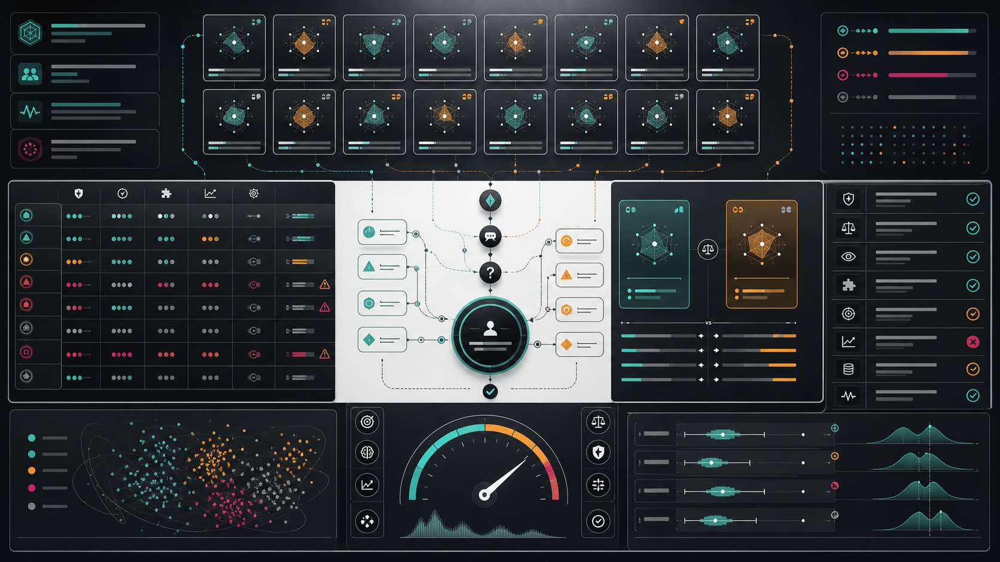

A rigorous cross-agent skill for MBTI-style personality typing that treats every type as a falsifiable hypothesis, not a label to be guessed.

This project is built for people who want serious type reasoning: multi-round interviews, transcript audits, adjacent-type duels, evidence ledgers, structured uncertainty, report audits, and regression-tested benchmark cases.

The GitHub social preview asset is stored at [docs/assets/social-preview.jpg](docs/assets/social-preview.jpg) so the repository can keep the same product signal when shared outside the README.

The GitHub product command-center asset is stored at [docs/assets/github-product-command-center.png](docs/assets/github-product-command-center.png). It is generated with `imagegen` as an atmosphere layer only; exact claims stay in SVG, Markdown, and audit scripts.

> MBTI can be a useful self-reflection language. It is not a clinical diagnostic instrument, not a hiring tool, and not a way to determine a person's worth or future.

## Experience Hub, Session Lab, Question Lab, Type Duel Lab, Agent Adapter Lab, Agent Portability Lab, Benchmark Arena, Benchmark Replay Lab, Calibration Lab, Follow-Up Lab, Response Eval Lab, and Playground

Open the local-first Experience Hub when you want a task-based command center, or jump directly into the Session Lab when you already have messy evidence:

- [GitHub Pages Experience Hub](https://zaoqu-liu.github.io/mbti-typing-skill/)
- [Local Experience Hub file](docs/index.html)
- [GitHub Pages Session Lab](https://zaoqu-liu.github.io/mbti-typing-skill/session-lab.html)
- [Local Session Lab file](docs/session-lab.html)
- [GitHub Pages Question Lab](https://zaoqu-liu.github.io/mbti-typing-skill/question-lab.html)
- [Local Question Lab file](docs/question-lab.html)
- [GitHub Pages Type Duel Lab](https://zaoqu-liu.github.io/mbti-typing-skill/type-duel-lab.html)
- [Local Type Duel Lab file](docs/type-duel-lab.html)
- [GitHub Pages Agent Adapter Lab](https://zaoqu-liu.github.io/mbti-typing-skill/agent-adapter-lab.html)
- [Local Agent Adapter Lab file](docs/agent-adapter-lab.html)
- [GitHub Pages Agent Portability Lab](https://zaoqu-liu.github.io/mbti-typing-skill/agent-portability-lab.html)
- [Local Agent Portability Lab file](docs/agent-portability-lab.html)
- [GitHub Pages Benchmark Arena](https://zaoqu-liu.github.io/mbti-typing-skill/case-gallery.html)
- [Local case gallery file](docs/case-gallery.html)
- [GitHub Pages Benchmark Replay Lab](https://zaoqu-liu.github.io/mbti-typing-skill/benchmark-replay-lab.html)
- [Local Benchmark Replay Lab file](docs/benchmark-replay-lab.html)
- [GitHub Pages Calibration Lab](https://zaoqu-liu.github.io/mbti-typing-skill/calibration-lab.html)
- [Local Calibration Lab file](docs/calibration-lab.html)
- [GitHub Pages Follow-Up Lab](https://zaoqu-liu.github.io/mbti-typing-skill/follow-up-lab.html)
- [Local Follow-Up Lab file](docs/follow-up-lab.html)
- [GitHub Pages Response Eval Lab](https://zaoqu-liu.github.io/mbti-typing-skill/response-eval-lab.html)
- [Local Response Eval Lab file](docs/response-eval-lab.html)
- [GitHub Pages playground](https://zaoqu-liu.github.io/mbti-typing-skill/playground.html)
- [Local playground file](docs/playground.html)

The Experience Hub turns the GitHub Pages root into a workflow selector with direct routes, a copyable starter prompt, and an Experience Hub Route Map. The Session Lab turns a claim and notes into a heuristic candidate board, evidence ledger, focused duels, next-question stack, report draft, copyable Codex prompt, share link, Import JSON recovery, and session state export. The Question Lab exposes `question-bank.md` as a searchable Round Builder with source-synced probes, 4-6 question templates, copyable next-round prompts, and `question_improvement.yml` issue seeds. The Type Duel Lab exposes the full `pair-duels.md` source as a searchable adjacent-type matrix with killer questions, losing conditions, copyable duel prompts, and `type_duel_improvement.yml` issue seeds. The Agent Adapter Lab turns `agent-adapters/manifest.json` into a selectable adoption surface with pack commands, install checklists, adapter JSON receipts, and `agent_adapter_improvement.yml` issue seeds. The Agent Portability Lab turns the same manifest into a capability-first Universal Agent Bridge for unknown host support, portable install recipes, `agent-portability-lab/v1` adapter drafts, and `agent_portability_request.yml` issue seeds. The Benchmark Arena is a case gallery of adversarial traps, runner-ups, falsifiers, reusable prompts, and benchmark issue seeds. The Benchmark Replay Lab turns the same canonical cases into a blind replay surface with hidden references, leading and runner-up guesses, Replay Receipt JSON, repair prompts, and `benchmark_replay_improvement.yml` issue seeds. The Calibration Lab lets users paste a typing report and receive a visible Calibration Receipt, repair prompt, JSON receipt, and failure issue seed. The Follow-Up Lab converts delayed real-world observations into a consented, redacted, public-safe JSON packet and issue seed. The Response Eval Lab lets users paste any MBTI answer and get a local quality radar, JSON receipt, repair prompt, and `response_eval_improvement.yml` issue seed. The Interactive Playground remains a faster visual preview of the same reasoning loop.

## One-Minute Demo

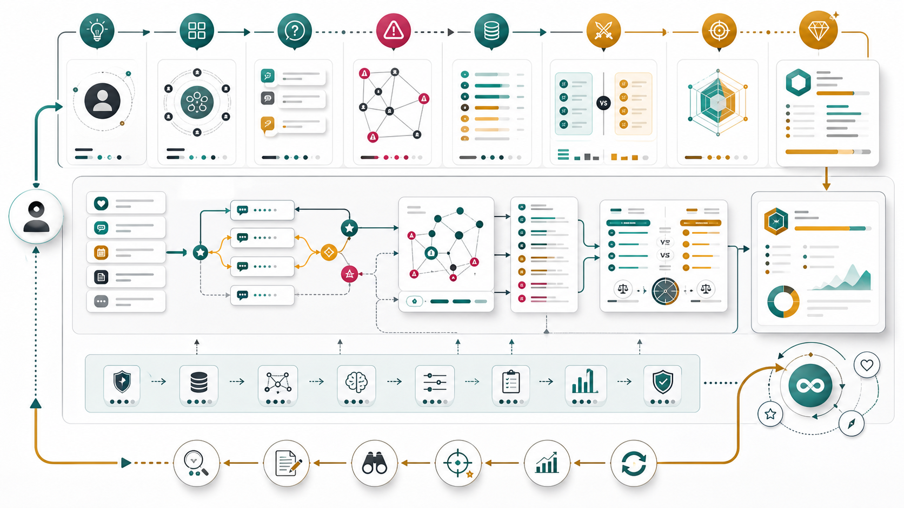

Start here if you want to feel the product before reading the internals:

- [Visual tour](docs/visual-tour.md): how the repository is meant to be read.
- [Experience Hub](docs/index.html): the Pages root command center with workflow cards, copyable starter prompt, and route-map visual.
- [Agent adapters](docs/agent-adapters.md): the first-class Core Pack for Codex, Claude Code, Cursor, and opencode, plus optional manifest recipes for ChatGPT GPTs/Projects, Zed, Devin, Gemini CLI, GitHub Copilot, Windsurf, Cline, Continue, aider, JetBrains Junie, Amazon Q, Roo Code, Kilo Code, and generic AGENTS.md-aware agents.
- [Agent pack export](agent-adapters/README.md): manifest-driven pack export for copying selected agent adapters into another repository without manual drift.
- [Agent Adapter Lab](docs/agent-adapter-lab.html): local-first target selector for pack commands, installation checklists, adapter JSON receipts, and adapter issue seeds.
- [Agent Portability Lab](docs/agent-portability-lab.html): capability-first Universal Agent Bridge for new or unknown agent hosts, portable install recipes, adapter JSON drafts, and `agent_portability_request.yml` issue seeds.
- [Response evaluation fixtures](examples/response-eval-cases.json): sticky precision cases that audit live-round, duel, final-report, and anti-pattern responses.
- [Response Eval Lab](docs/response-eval-lab.html): local-first answer quality radar with copyable repair prompts and response eval issue seeds.
- [Question Lab](docs/question-lab.html): source-synced Round Builder for the next 4-6 questions.
- [Type Duel Lab](docs/type-duel-lab.html): searchable adjacent-type duel matrix sourced from `pair-duels.md`.
- [Benchmark Arena](docs/case-gallery.html): adversarial case gallery for traps, runner-ups, and falsifiers.
- [Benchmark Replay Lab](docs/benchmark-replay-lab.html): blind replay for benchmark prompts, top-two guesses, reference reveal, repair prompts, and replay issue seeds.
- [Calibration Lab](docs/calibration-lab.html): blind calibration loop for checking reports against benchmark expectations.
- [Follow-Up Lab](docs/follow-up-lab.html): local-first consent packet builder for delayed observations, privacy gates, JSON export, and issue seeds.
- [Blind Review Protocol](docs/blind-review-protocol.md): sanitized multi-reviewer evaluation for top-1, top-2, runner-up, falsifier, boundary, and overclaim metrics.
- [Consent Redaction Protocol](docs/consent-redaction-protocol.md): public-safe route for consented follow-up observations, redaction, withdrawal, and delayed user feedback.
- [Demo session](docs/demo-session.md): a short ENTJ vs INTJ vs INFP example showing the live loop.
- [Sample report](docs/sample-report.md): what a calibrated final answer should look like.
- [Copy-paste prompt recipes](prompts/prompt-recipes.md): six ready-to-use prompts for live typing, duels, transcript audits, and report review.

The experience target is simple: every round should make the user feel that the next question was chosen because of their previous answer, not because the system is walking through a generic quiz.

## Product Experience Blueprints

The repository is designed like a product surface: a visitor should know where to click, why the workflow is different, and what proof backs it before they install anything.

### GitHub Product Command Center

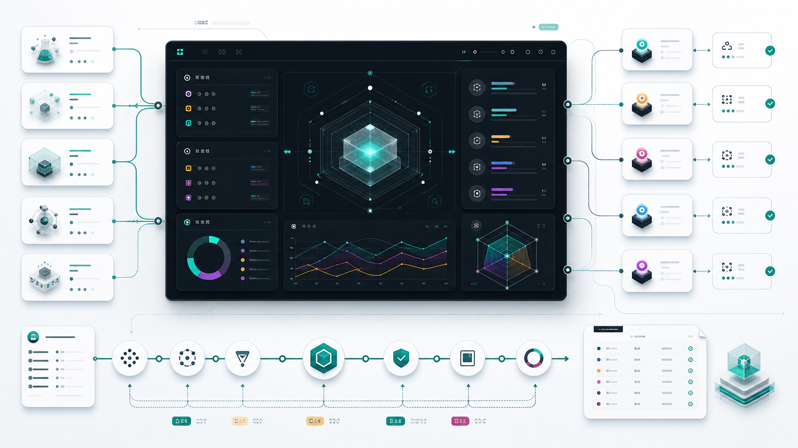

The GitHub Product Command Center is the `imagegen` atmosphere layer for the repository: a dense, inspectable product surface with labs, evidence lanes, adapter nodes, and audit receipts. It intentionally avoids readable generated text. Exact flow claims are carried by the SVGs and checked by `scripts/repository_scorecard.py`.

### Experience Hub Route Map

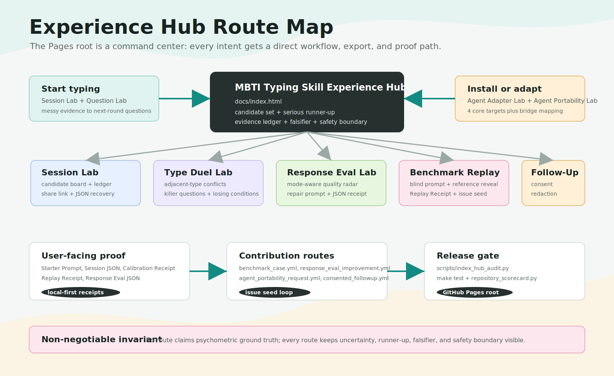

The Experience Hub Route Map explains the new Pages root: [docs/index.html](docs/index.html) no longer redirects to a single lab. It routes the visitor to typing, validation, benchmark replay, follow-up evidence, agent installation, future-host portability, or contribution paths, while preserving the candidate set, serious runner-up, evidence ledger, falsifier, and safety boundary contract. `scripts/index_hub_audit.py` gates the page for local-first rendering, workflow links, starter prompt copy, route-map visibility, safety language, and no unsafe HTML injection before release.

### GitHub UX Flywheel

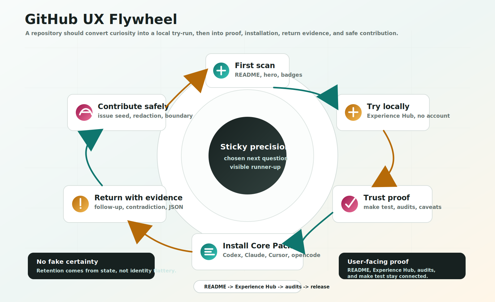

The GitHub UX Flywheel designs retention ethically: first scan, local try-run, proof, Core Pack installation, return evidence, and safe contribution. The sticky part is not identity flattery; it is visible state movement, a remembered runner-up, and the feeling that the next question was selected from the user's actual contradiction.

### GitHub Visitor Experience Map

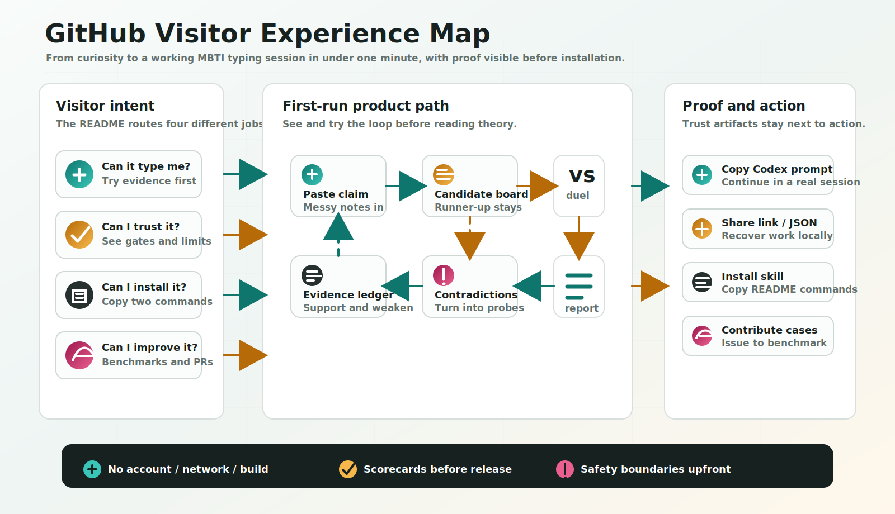

This map explains the first-run GitHub path: visitor intent, Session Lab, copyable prompt, share link, install commands, and contribution routes.

### MBTI Typing OS Stack

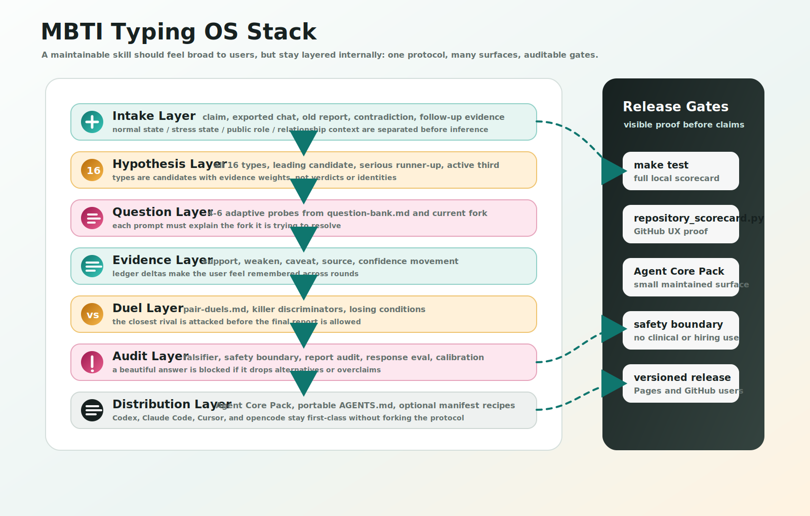

The MBTI Typing OS Stack shows how the broad user-facing skill stays maintainable: intake, hypothesis, question, evidence, duel, audit, distribution, and release gates are separate layers. This is why the repository can feel general and large without letting every new agent or lab fork the core protocol.

### Typing Engine Blueprint

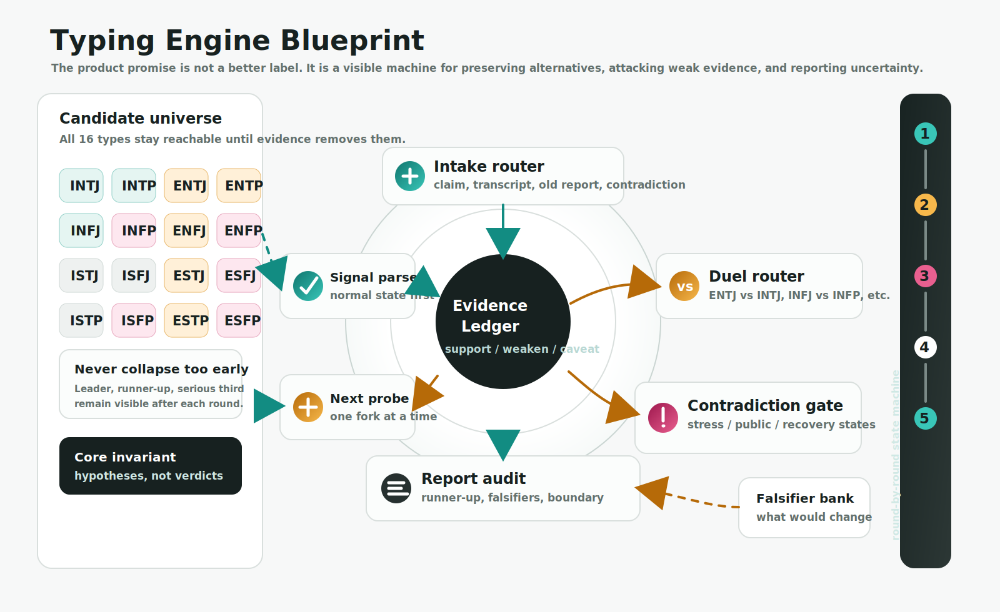

The blueprint shows the core reasoning machine: all 16 types remain in the universe, the candidate set feeds an evidence ledger, adjacent-type duels attack the strongest conflict, and reports must pass falsifier and boundary gates.

### Evidence Retention Loop

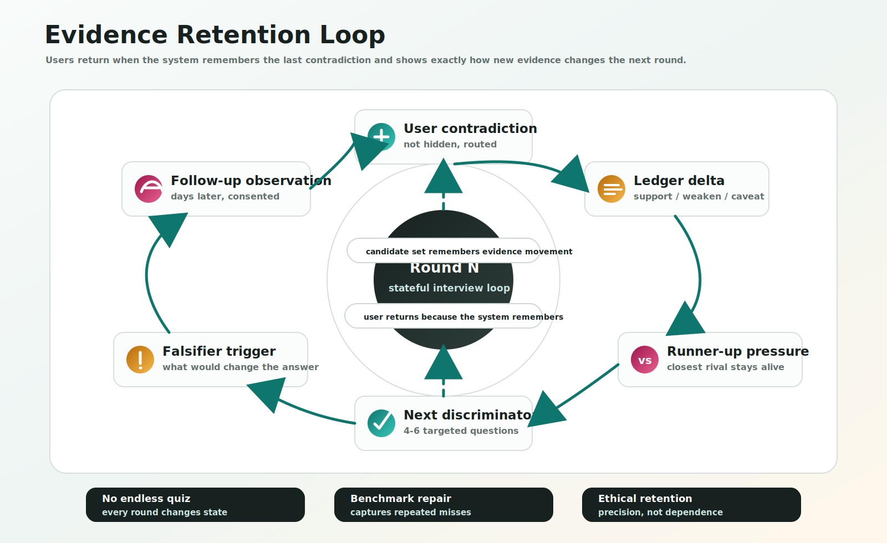

The Evidence Retention Loop is the answer to "why would people keep using it?": each return brings a contradiction, follow-up observation, or real-world miss back into the ledger. The system must show the delta, pressure the runner-up, select the next discriminator, and convert repeated misses into benchmark repair without pretending to be a clinical instrument.

### Trust Loop Dashboard

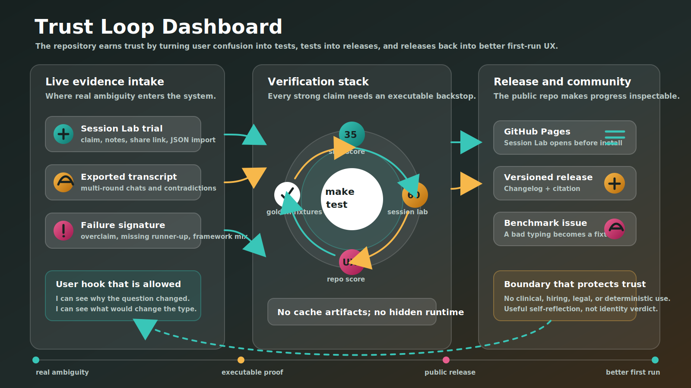

The trust loop connects real user ambiguity to benchmark cases, scorecards, GitHub Pages, versioned releases, and safer first-run UX.

### Benchmark Arena Pipeline

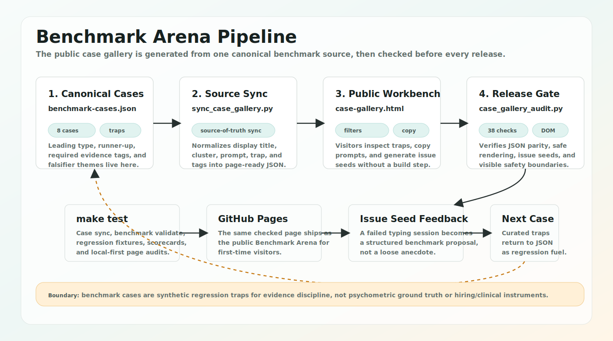

The Benchmark Arena Pipeline makes the case gallery auditable: `skill/mbti-typing/examples/benchmark-cases.json` is the canonical source, `scripts/sync_case_gallery.py` performs source-of-truth sync into `docs/case-gallery.html`, and the release gate checks that the public page cannot drift from the benchmark suite.

### Benchmark Replay Loop

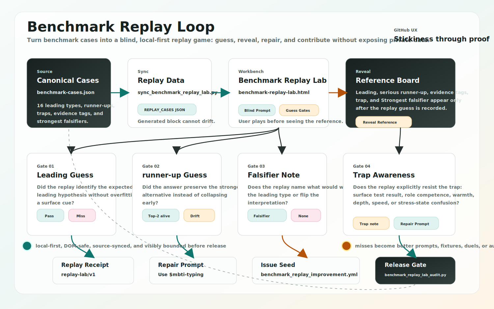

The Benchmark Replay Loop makes benchmark cases feel usable rather than merely inspectable: `scripts/sync_benchmark_replay_lab.py` embeds the canonical cases into `docs/benchmark-replay-lab.html`, users copy a blind prompt, record a leading type, runner-up, and falsifier guess, reveal the reference, then export a Replay Receipt, repair prompt, or `benchmark_replay_improvement.yml` issue seed. `scripts/benchmark_replay_lab_audit.py` blocks drift, unsafe rendering, missing copy outputs, and missing safety-boundary language before release.

### Benchmark Type Coverage Matrix

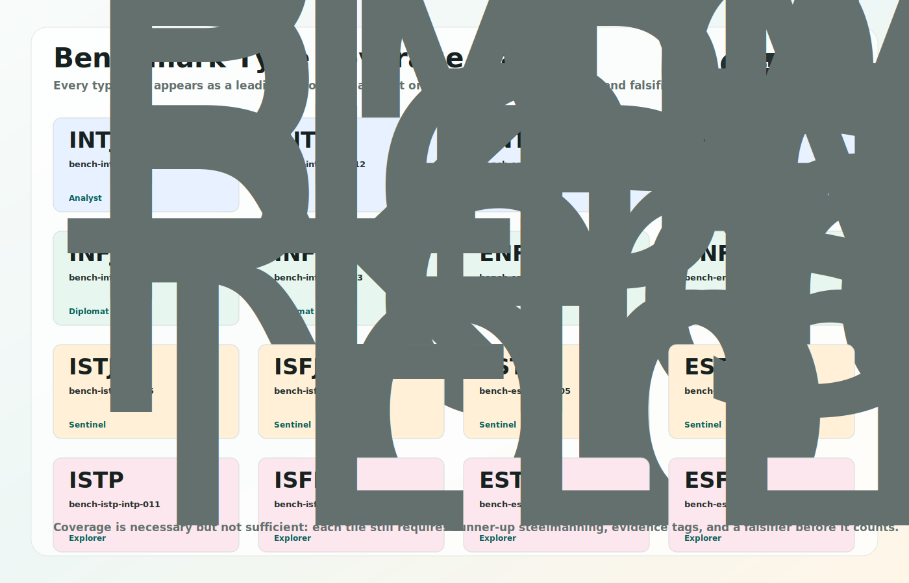

The expanded benchmark suite now covers all 16 MBTI type codes as leading hypotheses at least once. 16 / 16 covered does not claim psychometric truth; it means the regression suite can challenge every type with a visible runner-up, trap, evidence tag set, and falsifier theme.

### Calibration Loop Map

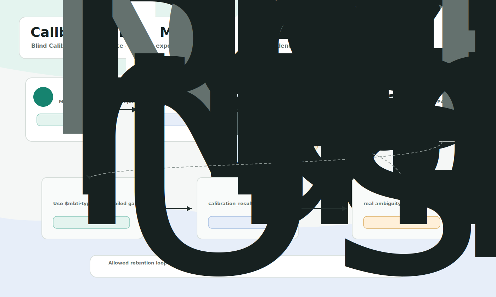

The Calibration Loop Map turns user-facing stickiness into an ethical verification loop: paste a report, run visible gates, get a Calibration Receipt, copy a repair prompt, and convert failures into a `calibration_result.yml` issue seed. Users come back because each miss becomes a sharper next run, not because the tool hides uncertainty.

### Blind Review Arena

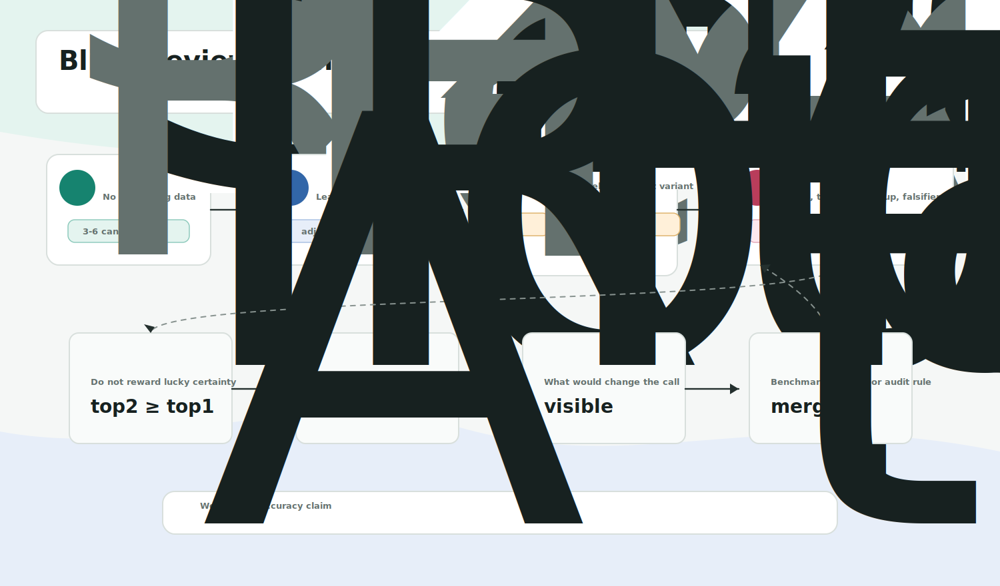

The Blind Review Arena is the accuracy layer after calibration. Sanitized packets hide the reference answer from independent reviewers, then `examples/blind-review-matrix.json` and `scripts/blind_review_audit.py` expose top-1, top-2, runner-up, evidence-tag, falsifier, boundary, and overclaim metrics. This is how the project can improve from misses without pretending synthetic benchmarks are psychometric truth.

### Consent Feedback Loop

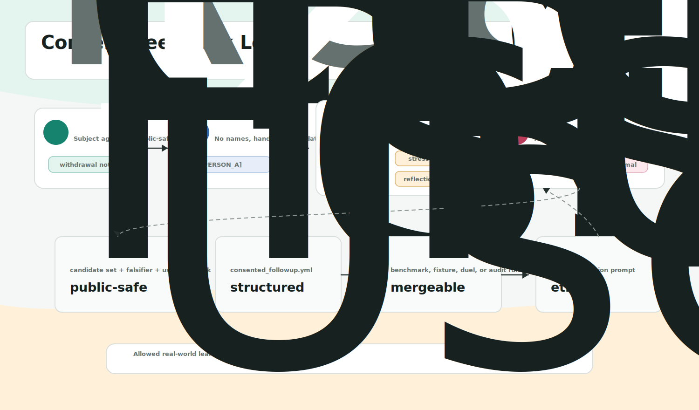

The Consent Feedback Loop is the safety layer for real-world learning. `docs/consent-redaction-protocol.md`, `examples/consented-followup-packet.json`, `.github/ISSUE_TEMPLATE/consented_followup.yml`, and `scripts/consent_redaction_audit.py` define how delayed user observations can be contributed without raw private chat logs, direct identifiers, third-party details, or irreversible public exposure. This lets the project learn from follow-up corrections while keeping consent, redaction, withdrawal, and data minimization visible.

### Type Duel Decision Map

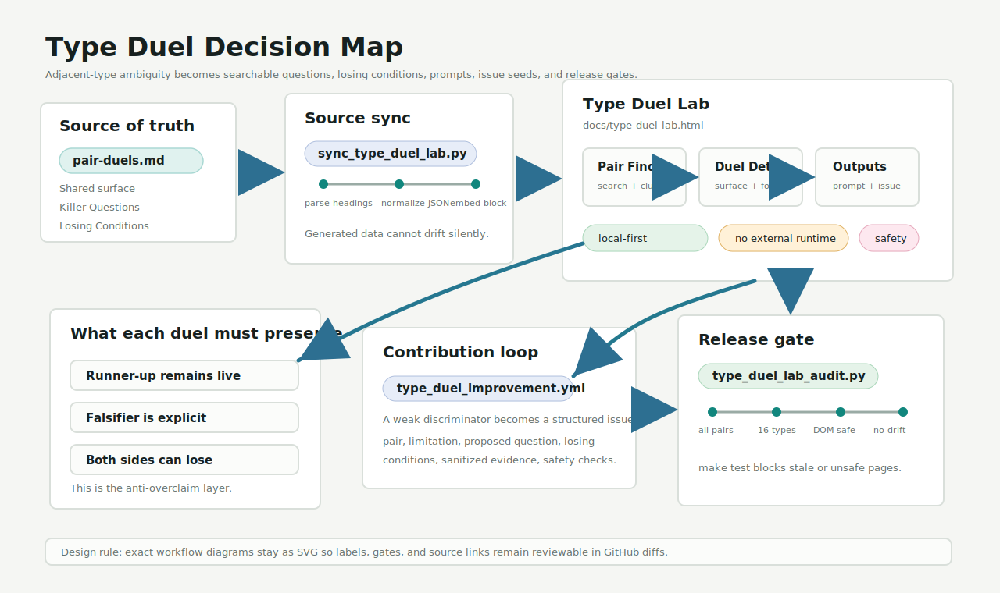

The Type Duel Decision Map shows how `skill/mbti-typing/references/pair-duels.md` becomes a product surface: `scripts/sync_type_duel_lab.py` parses the Markdown source into `docs/type-duel-lab.html`, users copy focused `$mbti-typing` duel prompts or `type_duel_improvement.yml` issue seeds, and `scripts/type_duel_lab_audit.py` blocks drift before release.

### Adaptive Question Loop

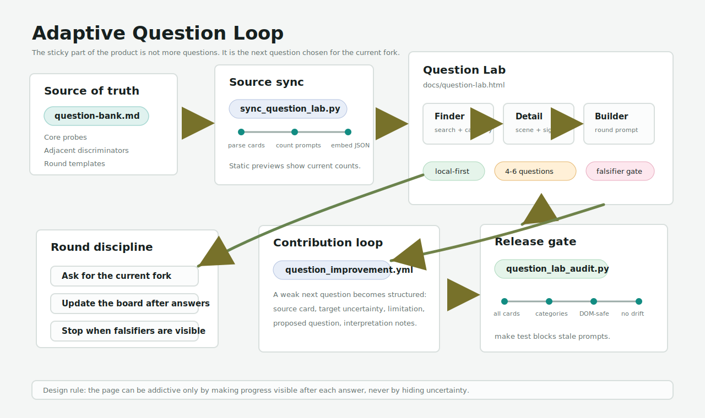

The Adaptive Question Loop shows how `skill/mbti-typing/references/question-bank.md` becomes the next-round engine: `scripts/sync_question_lab.py` parses source probes into `docs/question-lab.html`, users copy focused `$mbti-typing` round prompts or `question_improvement.yml` issue seeds, and `scripts/question_lab_audit.py` blocks stale or generic question flows before release.

### Agent Adapter Matrix

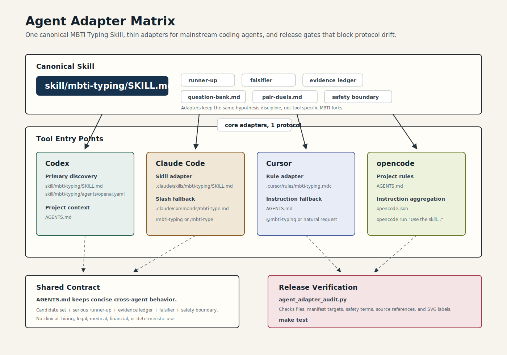

The Agent Adapter Matrix shows the core portability layer: `AGENTS.md`, `.claude/skills/mbti-typing/SKILL.md`, `.claude/commands/mbti-type.md`, `.cursor/rules/mbti-typing.mdc`, `opencode.json`, and `agent-adapters/manifest.json` all point back to the same canonical skill. `scripts/agent_adapter_audit.py` blocks tool-specific drift so Codex, Claude Code, Cursor, opencode, and general AGENTS.md-aware agents preserve runner-up, falsifier, evidence-ledger, and safety-boundary discipline.

### Agent Compatibility Grid

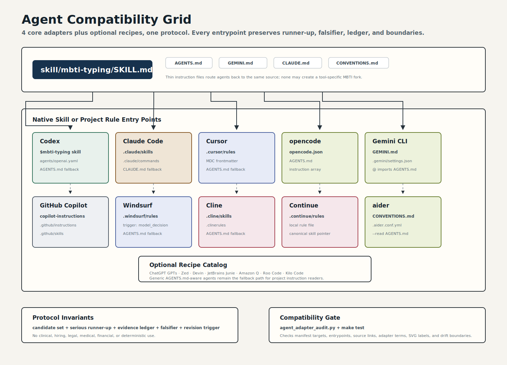

The Agent Compatibility Grid now uses a maintainable core-first model: Codex, Claude Code, Cursor, and opencode are the first-class Core Pack, while generic AGENTS.md-aware agents and additional host recipes remain available through the manifest when a team needs them. Extended recipes still cover ChatGPT GPTs/Projects, Zed Agent Panel, Devin, Gemini CLI, GitHub Copilot, Windsurf, Cline, Continue, aider, JetBrains Junie, Amazon Q Developer CLI, Roo Code, and Kilo Code without turning them into separate protocols. Every adapter file is audited for the same candidate-set, runner-up, falsifier, evidence-ledger, source-reference, and safety-boundary contract.

### Agent Pack Export Flow

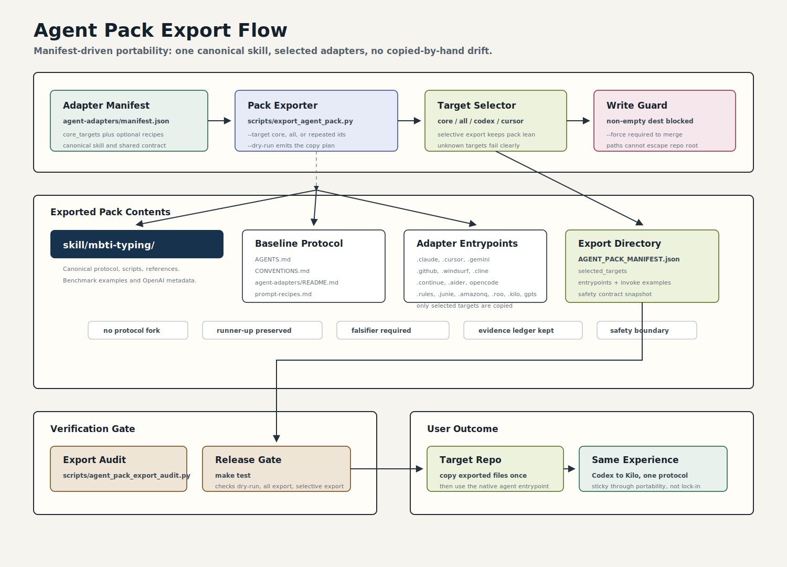

The Agent Pack Export Flow turns compatibility into something a user can actually move. `scripts/export_agent_pack.py` reads `agent-adapters/manifest.json`, exports the first-class Core Pack with `--target core`, supports deliberate `--target all`, and still allows a lean selected set such as `--target cursor --target cline`. The export includes the canonical `skill/mbti-typing/` directory, adapter docs, prompt recipes, selected entrypoints, and writes an `AGENT_PACK_MANIFEST.json` receipt. `scripts/agent_pack_export_audit.py` checks core export, dry-run JSON, all-target export, selective export, non-empty destination protection, unknown-target failure, and required files. This makes cross-agent adoption copyable and auditable instead of a hand-maintained checklist.

### Agent Adapter Lab Flow

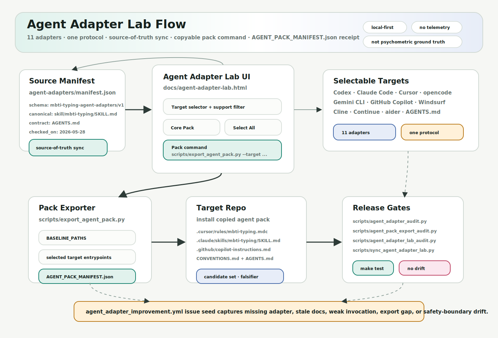

The Agent Adapter Lab Flow turns compatibility into a first-run UX: select a tool stack, copy a pack command, inspect the generated install checklist, export an adapter JSON receipt, and open an `agent_adapter_improvement.yml` issue seed if any target is missing or stale. `scripts/sync_agent_adapter_lab.py` keeps `docs/agent-adapter-lab.html` generated from `agent-adapters/manifest.json`, while `scripts/agent_adapter_lab_audit.py` blocks manifest drift, unsafe HTML injection, missing copy outputs, and missing safety-boundary language before release.

### Universal Agent Bridge Map

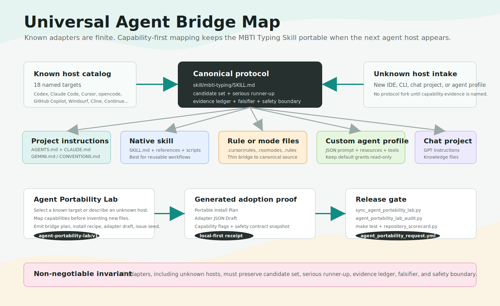

The Universal Agent Bridge Map is the generalization layer for future tools. `docs/agent-portability-lab.html` lets a user select a known target or type an unknown host, check capability evidence such as project instruction files, native `SKILL.md` directories, project rules, custom agent JSON profiles, slash commands, chat project instructions, or config instruction arrays, then copy a bridge plan, portable install recipe, `agent-portability-lab/v1` adapter draft, and `agent_portability_request.yml` issue seed. `scripts/sync_agent_portability_lab.py` keeps the page generated from `agent-adapters/manifest.json`, while `scripts/agent_portability_lab_audit.py` blocks capability drift, unsafe rendering, missing copy outputs, and missing safety-boundary language before release.

### Response Quality Radar

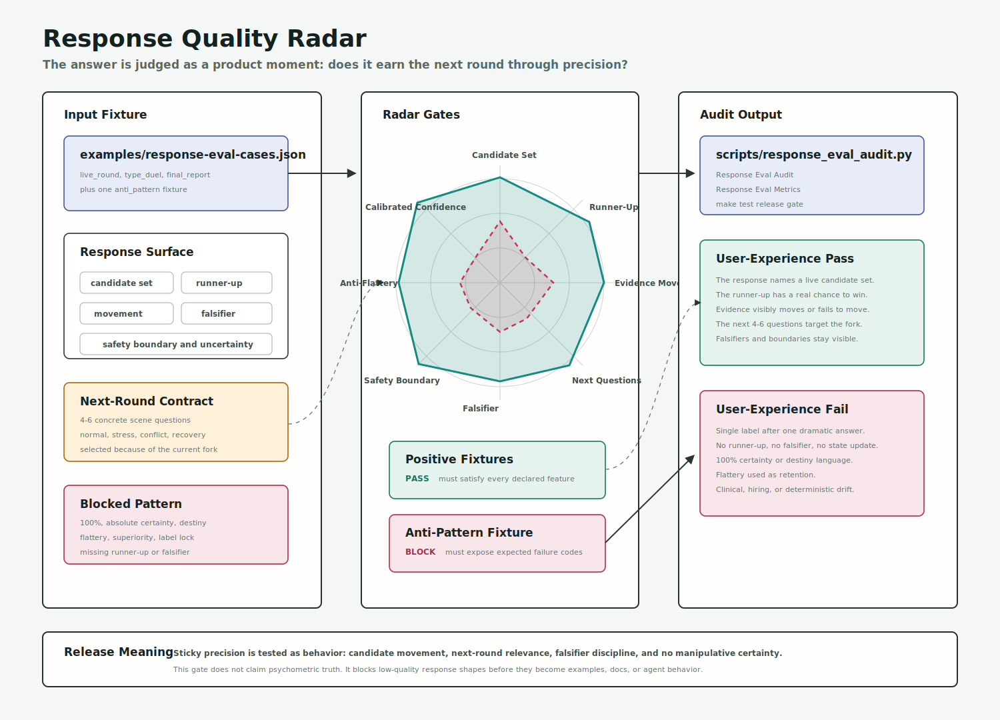

The Response Quality Radar is the answer-level UX gate. `examples/response-eval-cases.json` stores live-round, type-duel, final-report, and anti-pattern fixtures; `scripts/response_eval_audit.py` checks candidate set, serious runner-up, evidence movement, next 4-6 questions, falsifier, safety boundary, calibrated confidence, and Anti-Flattery discipline. The buildless [Response Eval Lab](docs/response-eval-lab.html) turns the same idea into a user-facing surface: paste any answer, inspect a mode-aware radar, copy a repair prompt, export JSON, or open a `response_eval_improvement.yml` issue seed. The audit must show `Response Eval Audit`, `Response Eval Lab Audit`, and `negative_blocked` at 100% before release. This is how sticky precision becomes testable instead of just a writing style claim.

### Response Eval Command Center


The Response Eval Command Center is the visual product target for the public lab: answer cards, quality gates, radar panels, issue paths, and audit receipts all remain visible at once. It is a generated bitmap asset with no readable UI text; exact claims live in the SVG and audits below.

### Response Eval Lab Flow

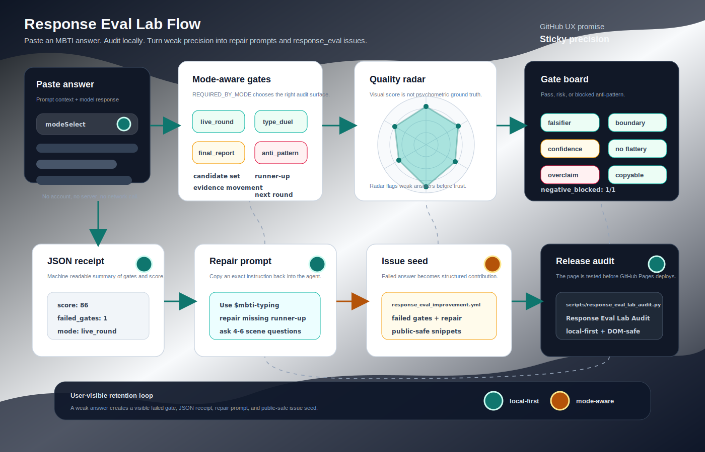

The Response Eval Lab Flow shows the user-retention loop as a concrete product path: paste an answer, choose mode-aware gates, inspect the quality radar, copy the JSON receipt, repair prompt, or `response_eval_improvement.yml` issue seed, then let `scripts/response_eval_lab_audit.py` keep the page local-first and DOM-safe. This is the answer-level counterpart to the benchmark and calibration loops.

## Visual System Map

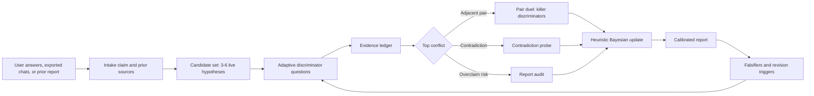
```mermaid
flowchart LR
    U[User answers, exported chats, or prior report] --> I[Intake claim and prior sources]
    I --> C[Candidate set: 3-6 live hypotheses]
    C --> Q[Adaptive discriminator questions]
    Q --> L[Evidence ledger]
    L --> D{Top conflict}
    D -->|Adjacent pair| P[Pair duel: killer discriminators]
    D -->|Contradiction| X[Contradiction probe]
    D -->|Overclaim risk| A[Report audit]
    P --> B[Heuristic Bayesian update]
    X --> B
    A --> B
    B --> R[Calibrated report]
    R --> F[Falsifiers and revision triggers]
    F --> Q
```

## Why This Exists

Most MBTI workflows fail in predictable ways:

- They overfit one dramatic answer.
- They confuse stress behavior with normal cognition.
- They collapse adjacent types too early.
- They use beautiful prose instead of falsifiable evidence.
- They mix MBTI, Big Five, Enneagram, A/T, attachment, and culture without boundaries.

This skill is designed to prevent those failures. It forces the agent to maintain a candidate set, preserve runner-up types, track contradictions, ask targeted discriminators, and state what would change the conclusion.

## What Makes It Different

- **Mode selector**: live typing, transcript audit, type duel, report review, or protocol design.
- **Evidence ledger**: every claim should connect to observations, alternatives, and caveats.
- **Session state machine**: long interviews can be resumed without losing contradictions.
- **Pair duels**: high-risk type pairs have targeted discriminators and losing conditions.
- **Chinese output style**: sharp, high-retention Chinese updates without flattery or fake certainty.
- **Report audit**: catches missing runner-up, missing evidence, missing falsifiers, overclaiming, and framework mixing.
- **Benchmark suite**: synthetic high-risk cases plus golden good/bad fixtures for regression testing.
- **Self-scorecard**: the skill audits itself and must pass package-level checks.

## Adaptive Typing Loop

The user experience is designed to be sticky through precision, not manipulation. Every round should reveal why the next question exists.

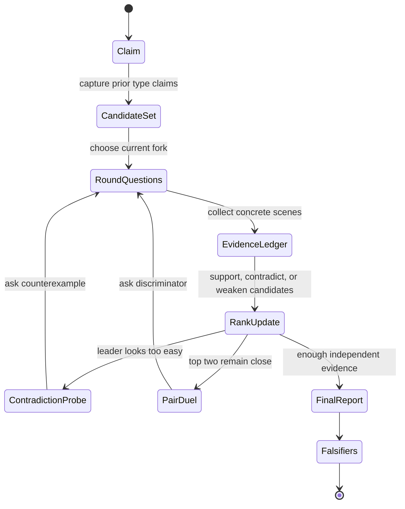
```mermaid
stateDiagram-v2
    [*] --> Claim
    Claim --> CandidateSet: capture prior type claims
    CandidateSet --> RoundQuestions: choose current fork
    RoundQuestions --> EvidenceLedger: collect concrete scenes
    EvidenceLedger --> RankUpdate: support, contradict, or weaken candidates
    RankUpdate --> ContradictionProbe: leader looks too easy
    RankUpdate --> PairDuel: top two remain close
    ContradictionProbe --> RoundQuestions: ask counterexample
    PairDuel --> RoundQuestions: ask discriminator
    RankUpdate --> FinalReport: enough independent evidence
    FinalReport --> Falsifiers
    Falsifiers --> [*]
```

## Evidence Ledger Flow

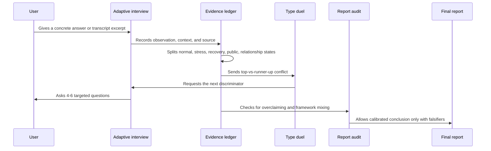
```mermaid
sequenceDiagram
    participant User
    participant Interview as Adaptive interview
    participant Ledger as Evidence ledger
    participant Duel as Type duel
    participant Audit as Report audit
    participant Output as Final report

    User->>Interview: Gives a concrete answer or transcript excerpt
    Interview->>Ledger: Records observation, context, and source
    Ledger->>Ledger: Splits normal, stress, recovery, public, relationship states
    Ledger->>Duel: Sends top-vs-runner-up conflict
    Duel->>Interview: Requests the next discriminator
    Interview->>User: Asks 4-6 targeted questions
    Ledger->>Audit: Checks for overclaiming and framework mixing
    Audit->>Output: Allows calibrated conclusion only with falsifiers
```

## Repository Layout

```text
.
  README.md
  README.zh-CN.md
  AGENTS.md
  CLAUDE.md
  GEMINI.md
  CONVENTIONS.md
  opencode.json
  .aider.conf.yml
  agent-adapters/
    README.md
    manifest.json
  .gemini/
    settings.json
  .claude/
    skills/mbti-typing/SKILL.md
    commands/mbti-type.md
  .cursor/
    rules/mbti-typing.mdc
  .github/
    copilot-instructions.md
    instructions/mbti-typing.instructions.md
    skills/mbti-typing/SKILL.md
    ISSUE_TEMPLATE/agent_adapter_improvement.yml
  .windsurf/
    rules/mbti-typing.md
  .cline/
    skills/mbti-typing/SKILL.md
  .clinerules/
    mbti-typing.md
  .continue/
    rules/mbti-typing.md
  prompts/
    prompt-recipes.md
  docs/
    visual-tour.md
    agent-adapters.md
    blind-review-protocol.md
    consent-redaction-protocol.md
    demo-session.md
    sample-report.md
    session-lab.html
    question-lab.html
    case-gallery.html
    calibration-lab.html
    type-duel-lab.html
    agent-adapter-lab.html
    follow-up-lab.html
    response-eval-lab.html
    playground.html
    assets/
      mbti-typing-hero.png
      typing-journey-map.png
      social-preview.jpg
      github-product-command-center.png
      response-eval-command-center.png
      repository-experience-map.svg
      github-ux-flywheel.svg
      typing-os-stack.svg
      typing-engine-blueprint.svg
      evidence-retention-loop.svg
      trust-loop-dashboard.svg
      benchmark-arena-pipeline.svg
      type-coverage-matrix.svg
      calibration-loop-map.svg
      blind-review-arena.svg
      consent-feedback-loop.svg
      type-duel-decision-map.svg
      adaptive-question-loop.svg
      agent-adapter-matrix.svg
      agent-compatibility-grid.svg
      agent-pack-export-flow.svg
      agent-adapter-lab-flow.svg
      response-quality-radar.svg
      response-eval-lab-flow.svg
  examples/
    session-state-example.json
    evidence-ledger-example.md
    blind-review-matrix.json
    consented-followup-packet.json
    response-eval-cases.json
  skill/mbti-typing/
    SKILL.md
    references/
    examples/
    scripts/
  scripts/
    export_agent_pack.py
    agent_pack_export_audit.py
    agent_adapter_audit.py
    sync_agent_adapter_lab.py
    agent_adapter_lab_audit.py
    response_eval_audit.py
    response_eval_lab_audit.py
```

## Install

Clone the repository and copy the skill folder into your Codex skills directory:

```bash
git clone https://github.com/Zaoqu-Liu/mbti-typing-skill.git
cp -R mbti-typing-skill/skill/mbti-typing ~/.codex/skills/
```

Then invoke it in Codex:

```text
Use $mbti-typing to run a rigorous multi-round MBTI typing interview.
```

For other agent tools, keep the adapter files with the target repository:

- Codex: `skill/mbti-typing/SKILL.md`, `skill/mbti-typing/agents/openai.yaml`, and `AGENTS.md`.
- Generic AGENTS.md-aware agents: `AGENTS.md` plus `CONVENTIONS.md`.
- Claude Code: `.claude/skills/mbti-typing/SKILL.md` plus `.claude/commands/mbti-type.md`.
- Cursor: `.cursor/rules/mbti-typing.mdc` plus `AGENTS.md`.
- opencode: `AGENTS.md` plus `opencode.json`.
- Gemini CLI: `GEMINI.md`, `.gemini/settings.json`, and `AGENTS.md`.
- GitHub Copilot: `.github/copilot-instructions.md`, `.github/instructions/mbti-typing.instructions.md`, and `.github/skills/mbti-typing/SKILL.md`.
- Windsurf: `.windsurf/rules/mbti-typing.md` plus `AGENTS.md`.
- Cline: `.cline/skills/mbti-typing/SKILL.md`, `.clinerules/mbti-typing.md`, and `AGENTS.md`.
- Continue: `.continue/rules/mbti-typing.md` plus `AGENTS.md`.
- aider: `CONVENTIONS.md`, `.aider.conf.yml`, and `AGENTS.md`.
- Optional manifest recipes: Zed uses `.rules`; Roo Code uses `.roomodes` and `.roo/rules-mbti-typing/mbti-typing.md`; Kilo Code uses `kilo.jsonc` and `.kilo/rules/mbti-typing.md`; Amazon Q Developer CLI uses `.amazonq/cli-agents/mbti-typing.json`; JetBrains Junie uses `.junie/AGENTS.md` and `.junie/commands/mbti-type.md`; ChatGPT GPTs/Projects use `gpts/mbti-typing-gpt-instructions.md`.

The cross-agent contract is documented in [docs/agent-adapters.md](docs/agent-adapters.md) and indexed by [agent-adapters/manifest.json](agent-adapters/manifest.json).

## Quick Start

### Live Typing

```text
Use $mbti-typing. Someone says I am INFP, but I often test ENTJ. Keep asking until the evidence clearly supports or disproves the claim.
```

Expected behavior:

- Build candidate set.
- Ask 4-6 targeted questions per round.
- Preserve runner-up types.
- Update the evidence board after each round.
- End with falsifiers, not fake certainty.

### Type Duel

```text
Use $mbti-typing to distinguish ENTJ vs INTJ. Focus on Te-dom vs Ni-dom, not generic extroversion.
```

### Transcript Audit

```text
Use $mbti-typing to audit these exported conversations and extract the evidence, reversals, overclaims, and best current formulation.
```

### Report Review

```text
Use $mbti-typing to review this MBTI report for unsupported claims, missing differential diagnosis, framework mixing, and overconfidence.
```

## Validation

Run the full local scorecard:

```bash
make test
```

Equivalent direct commands:

```bash
python3 -B skill/mbti-typing/scripts/benchmark_cases.py validate skill/mbti-typing/examples/benchmark-cases.json
python3 -B skill/mbti-typing/scripts/benchmark_cases.py regression skill/mbti-typing/examples/benchmark-cases.json skill/mbti-typing/examples/golden-reports.json
python3 -B skill/mbti-typing/scripts/skill_scorecard.py skill/mbti-typing
python3 -B skill/mbti-typing/scripts/typing_session.py validate examples/session-state-example.json --final
python3 -B skill/mbti-typing/scripts/report_audit.py --fail-on-findings docs/sample-report.md
python3 -B scripts/blind_review_audit.py examples/blind-review-matrix.json
python3 -B scripts/consent_redaction_audit.py examples/consented-followup-packet.json
python3 -B scripts/agent_adapter_audit.py .
python3 -B scripts/agent_pack_export_audit.py .
python3 -B scripts/sync_agent_adapter_lab.py agent-adapters/manifest.json docs/agent-adapter-lab.html
python3 -B scripts/agent_adapter_lab_audit.py docs/agent-adapter-lab.html agent-adapters/manifest.json
python3 -B scripts/sync_agent_portability_lab.py agent-adapters/manifest.json docs/agent-portability-lab.html
python3 -B scripts/agent_portability_lab_audit.py docs/agent-portability-lab.html agent-adapters/manifest.json .github/ISSUE_TEMPLATE/agent_portability_request.yml
python3 -B scripts/index_hub_audit.py docs/index.html docs/assets/experience-hub-route-map.svg
python3 -B scripts/response_eval_audit.py examples/response-eval-cases.json
python3 -B scripts/response_eval_lab_audit.py docs/response-eval-lab.html
python3 -B scripts/sync_question_lab.py skill/mbti-typing/references/question-bank.md docs/question-lab.html
python3 -B scripts/question_lab_audit.py docs/question-lab.html skill/mbti-typing/references/question-bank.md
python3 -B scripts/sync_type_duel_lab.py skill/mbti-typing/references/pair-duels.md docs/type-duel-lab.html
python3 -B scripts/type_duel_lab_audit.py docs/type-duel-lab.html skill/mbti-typing/references/pair-duels.md
python3 -B scripts/session_lab_audit.py docs/session-lab.html
python3 -B scripts/sync_case_gallery.py skill/mbti-typing/examples/benchmark-cases.json docs/case-gallery.html
python3 -B scripts/case_gallery_audit.py docs/case-gallery.html skill/mbti-typing/examples/benchmark-cases.json
python3 -B scripts/sync_benchmark_replay_lab.py skill/mbti-typing/examples/benchmark-cases.json docs/benchmark-replay-lab.html
python3 -B scripts/benchmark_replay_lab_audit.py docs/benchmark-replay-lab.html skill/mbti-typing/examples/benchmark-cases.json .github/ISSUE_TEMPLATE/benchmark_replay_improvement.yml
python3 -B scripts/sync_calibration_lab.py skill/mbti-typing/examples/benchmark-cases.json docs/calibration-lab.html
python3 -B scripts/calibration_lab_audit.py docs/calibration-lab.html skill/mbti-typing/examples/benchmark-cases.json
python3 -B scripts/follow_up_lab_audit.py docs/follow-up-lab.html
python3 -B scripts/repository_scorecard.py .
```

Expected result:

```text
Score: 35/35 (100.00%)
Regression passed for 16 golden fixtures.
Session Lab Audit: 61/61 (100.00%)
Blind Review Audit: 93/93 (100.00%)
Blind Review Metrics: top1: 5/6 (83.33%); top2: 6/6 (100.00%)
Consent Redaction Audit: 78/78 (100.00%)
Consent Redaction Metrics: packets=2; observations=6; states=5; privacy_safe=2/2; feedback=2/2
Agent Adapter Audit: 328/328 (100.00%)
Agent Pack Export Audit: 28/28 (100.00%)
Agent Adapter Lab Source Sync: PASS (18 targets match)
Agent Adapter Lab Audit: 94/94 (100.00%)
Agent Portability Lab Source Sync: PASS (18 targets, 7 capabilities match)
Agent Portability Lab Audit: 92/92 (100.00%)
Index Hub Audit: 82/82 (100.00%)
Response Eval Audit: 45/45 (100.00%)
Response Eval Metrics: cases=4; positive_pass: 3/3 (100.00%); negative_blocked: 1/1 (100.00%); sticky_precision: 3/3 (100.00%); next_round: 3/3 (100.00%); no_overclaim: 3/3 (100.00%)
Response Eval Lab Audit: 69/69 (100.00%)
Question Lab Source Sync: PASS (21 cards match)
Question Lab Audit: 71/71 (100.00%)
Type Duel Lab Source Sync: PASS (20 duels match)
Type Duel Lab Audit: 68/68 (100.00%)
Case Gallery Source Sync: PASS (16 cases match)
Case Gallery Audit: 48/48 (100.00%)
Benchmark Replay Lab Source Sync: PASS (16 cases match)
Benchmark Replay Lab Audit: 62/62 (100.00%)
Calibration Lab Source Sync: PASS (16 cases match)
Calibration Lab Audit: 53/53 (100.00%)
Follow-Up Lab Audit: 61/61 (100.00%)
Repository UX Score: 670/670 (100.00%)
```

For the full evaluation model, see [docs/evaluation.md](docs/evaluation.md).

## Quality Gate Pipeline

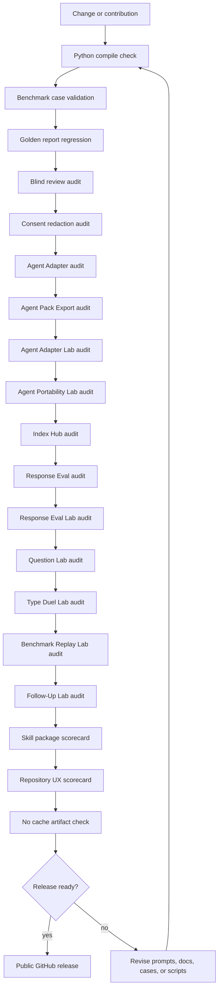
```mermaid
flowchart TD
    PR[Change or contribution] --> Compile[Python compile check]
    Compile --> Cases[Benchmark case validation]
    Cases --> Golden[Golden report regression]
    Golden --> Blind[Blind review audit]
    Blind --> Consent[Consent redaction audit]
    Consent --> Adapter[Agent Adapter audit]
    Adapter --> Pack[Agent Pack Export audit]
    Pack --> AdapterLab[Agent Adapter Lab audit]
    AdapterLab --> Portability[Agent Portability Lab audit]
    Portability --> IndexHub[Index Hub audit]
    IndexHub --> Response[Response Eval audit]
    Response --> ResponseLab[Response Eval Lab audit]
    ResponseLab --> QuestionLab[Question Lab audit]
    QuestionLab --> TypeDuel[Type Duel Lab audit]
    TypeDuel --> Replay[Benchmark Replay Lab audit]
    Replay --> FollowUp[Follow-Up Lab audit]
    FollowUp --> SkillScore[Skill package scorecard]
    SkillScore --> UXScore[Repository UX scorecard]
    UXScore --> Cache[No cache artifact check]
    Cache --> Release{Release ready?}
    Release -->|yes| Publish[Public GitHub release]
    Release -->|no| Fix[Revise prompts, docs, cases, or scripts]
    Fix --> Compile
```

## Quality Model

A serious final typing must include:

- A leading formulation and a serious runner-up.
- At least two independent discriminators for the top pair.
- Normal-state evidence and stress/recovery/conflict evidence.
- A cross-framework check or an explicit reason to skip it.
- Falsifiers: what would change the conclusion.
- Framework boundaries: what is MBTI, what is Big Five, what is A/T, and what is only an observation.

For the interaction design principles behind the live typing experience, see [docs/experience-principles.md](docs/experience-principles.md).

## Trust Architecture

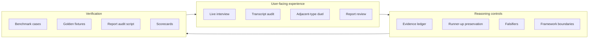
```mermaid
flowchart LR
    subgraph UX[User-facing experience]
        Live[Live interview]
        Transcript[Transcript audit]
        Duel[Adjacent-type duel]
        Review[Report review]
    end

    subgraph Reasoning[Reasoning controls]
        Ledger[Evidence ledger]
        RunnerUp[Runner-up preservation]
        Falsifier[Falsifiers]
        Boundaries[Framework boundaries]
    end

    subgraph Verification[Verification]
        Bench[Benchmark cases]
        Golden[Golden fixtures]
        Audit[Report audit script]
        Score[Scorecards]
    end

    UX --> Reasoning
    Reasoning --> Verification
    Verification --> UX
```

## Safety Boundaries

Do not use this skill for:

- Clinical diagnosis.
- Hiring, school admission, or selection.
- Legal, medical, or financial decisions.
- Deterministic claims about a person's worth, destiny, or future.

Do use it for:

- Structured self-reflection.
- Better interview questions.
- Evidence-based personality reports.
- Reviewing and improving existing MBTI analyses.
- Learning how to reason about ambiguous personality evidence.

## Contributing

Contributions are welcome if they improve rigor, coverage, safety, or user experience. See [CONTRIBUTING.md](CONTRIBUTING.md).

Good contributions include:

- New benchmark cases with clear traps and expected runner-up types.
- Better pair-duel discriminators.
- Stronger report audit checks.
- More realistic golden fixtures.
- Clearer Chinese or English output templates.

## License

MIT. See [LICENSE](LICENSE).
