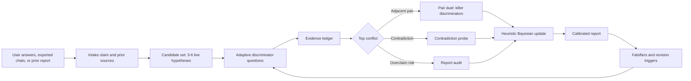
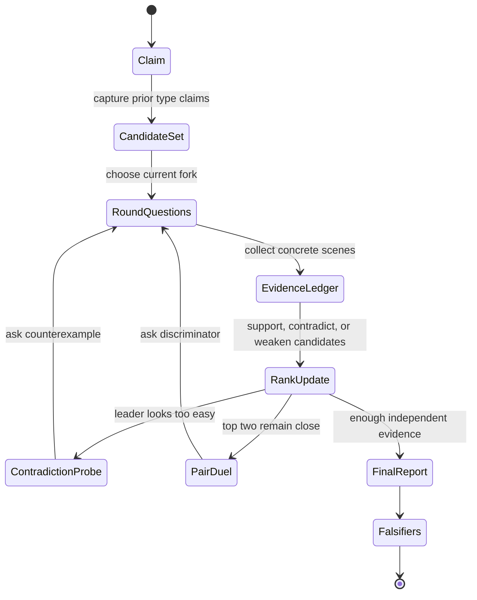
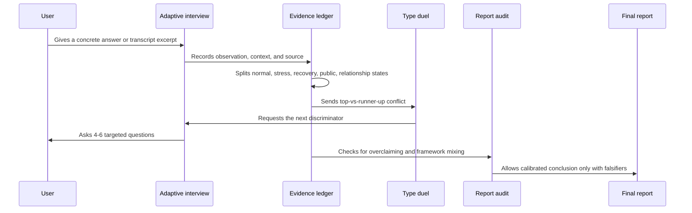
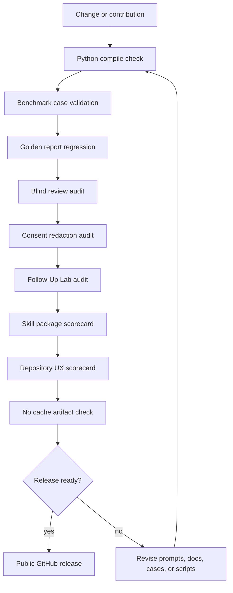
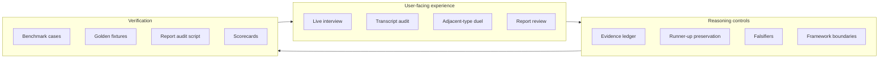

# MBTI Typing Skill

[](https://github.com/Zaoqu-Liu/mbti-typing-skill/actions/workflows/ci.yml)


A rigorous Codex skill for MBTI-style personality typing that treats every type as a falsifiable hypothesis, not a label to be guessed.

This project is built for people who want serious type reasoning: multi-round interviews, transcript audits, adjacent-type duels, evidence ledgers, structured uncertainty, report audits, and regression-tested benchmark cases.

> MBTI can be a useful self-reflection language. It is not a clinical diagnostic instrument, not a hiring tool, and not a way to determine a person's worth or future.

## Session Lab, Benchmark Arena, Calibration Lab, Follow-Up Lab, and Playground

Open the local-first Session Lab when you want to paste messy evidence and generate a usable next round before installing anything:

- [GitHub Pages Session Lab](https://zaoqu-liu.github.io/mbti-typing-skill/session-lab.html)
- [Local Session Lab file](docs/session-lab.html)
- [GitHub Pages Benchmark Arena](https://zaoqu-liu.github.io/mbti-typing-skill/case-gallery.html)
- [Local case gallery file](docs/case-gallery.html)
- [GitHub Pages Calibration Lab](https://zaoqu-liu.github.io/mbti-typing-skill/calibration-lab.html)
- [Local Calibration Lab file](docs/calibration-lab.html)
- [GitHub Pages Follow-Up Lab](https://zaoqu-liu.github.io/mbti-typing-skill/follow-up-lab.html)
- [Local Follow-Up Lab file](docs/follow-up-lab.html)
- [GitHub Pages playground](https://zaoqu-liu.github.io/mbti-typing-skill/playground.html)
- [Local playground file](docs/playground.html)

The Session Lab turns a claim and notes into a heuristic candidate board, evidence ledger, focused duels, next-question stack, report draft, copyable Codex prompt, share link, Import JSON recovery, and session state export. The Benchmark Arena is a case gallery of adversarial traps, runner-ups, falsifiers, reusable prompts, and benchmark issue seeds. The Calibration Lab lets users paste a typing report and receive a visible Calibration Receipt, repair prompt, JSON receipt, and failure issue seed. The Follow-Up Lab converts delayed real-world observations into a consented, redacted, public-safe JSON packet and issue seed. The Interactive Playground remains a faster visual preview of the same reasoning loop.

## One-Minute Demo


Start here if you want to feel the product before reading the internals:

- [Visual tour](docs/visual-tour.md): how the repository is meant to be read.
- [Benchmark Arena](docs/case-gallery.html): adversarial case gallery for traps, runner-ups, and falsifiers.
- [Calibration Lab](docs/calibration-lab.html): blind calibration loop for checking reports against benchmark expectations.
- [Follow-Up Lab](docs/follow-up-lab.html): local-first consent packet builder for delayed observations, privacy gates, JSON export, and issue seeds.
- [Blind Review Protocol](docs/blind-review-protocol.md): sanitized multi-reviewer evaluation for top-1, top-2, runner-up, falsifier, boundary, and overclaim metrics.
- [Consent Redaction Protocol](docs/consent-redaction-protocol.md): public-safe route for consented follow-up observations, redaction, withdrawal, and delayed user feedback.
- [Demo session](docs/demo-session.md): a short ENTJ vs INTJ vs INFP example showing the live loop.
- [Sample report](docs/sample-report.md): what a calibrated final answer should look like.
- [Copy-paste prompt recipes](prompts/prompt-recipes.md): six ready-to-use prompts for live typing, duels, transcript audits, and report review.

The experience target is simple: every round should make the user feel that the next question was chosen because of their previous answer, not because the system is walking through a generic quiz.

## Product Experience Blueprints

The repository is designed like a product surface: a visitor should know where to click, why the workflow is different, and what proof backs it before they install anything.

### GitHub Visitor Experience Map


This map explains the first-run GitHub path: visitor intent, Session Lab, copyable prompt, share link, install commands, and contribution routes.

### Typing Engine Blueprint


The blueprint shows the core reasoning machine: all 16 types remain in the universe, the candidate set feeds an evidence ledger, adjacent-type duels attack the strongest conflict, and reports must pass falsifier and boundary gates.

### Trust Loop Dashboard


The trust loop connects real user ambiguity to benchmark cases, scorecards, GitHub Pages, versioned releases, and safer first-run UX.

### Benchmark Arena Pipeline


The Benchmark Arena Pipeline makes the case gallery auditable: `skill/mbti-typing/examples/benchmark-cases.json` is the canonical source, `scripts/sync_case_gallery.py` performs source-of-truth sync into `docs/case-gallery.html`, and the release gate checks that the public page cannot drift from the benchmark suite.

### Benchmark Type Coverage Matrix


The expanded benchmark suite now covers all 16 MBTI type codes as leading hypotheses at least once. 16 / 16 covered does not claim psychometric truth; it means the regression suite can challenge every type with a visible runner-up, trap, evidence tag set, and falsifier theme.

### Calibration Loop Map


The Calibration Loop Map turns user-facing stickiness into an ethical verification loop: paste a report, run visible gates, get a Calibration Receipt, copy a repair prompt, and convert failures into a `calibration_result.yml` issue seed. Users come back because each miss becomes a sharper next run, not because the tool hides uncertainty.

### Blind Review Arena


The Blind Review Arena is the accuracy layer after calibration. Sanitized packets hide the reference answer from independent reviewers, then `examples/blind-review-matrix.json` and `scripts/blind_review_audit.py` expose top-1, top-2, runner-up, evidence-tag, falsifier, boundary, and overclaim metrics. This is how the project can improve from misses without pretending synthetic benchmarks are psychometric truth.

### Consent Feedback Loop


The Consent Feedback Loop is the safety layer for real-world learning. `docs/consent-redaction-protocol.md`, `examples/consented-followup-packet.json`, `.github/ISSUE_TEMPLATE/consented_followup.yml`, and `scripts/consent_redaction_audit.py` define how delayed user observations can be contributed without raw private chat logs, direct identifiers, third-party details, or irreversible public exposure. This lets the project learn from follow-up corrections while keeping consent, redaction, withdrawal, and data minimization visible.

## Visual System Map



## Why This Exists

Most MBTI workflows fail in predictable ways:

- They overfit one dramatic answer.
- They confuse stress behavior with normal cognition.
- They collapse adjacent types too early.
- They use beautiful prose instead of falsifiable evidence.
- They mix MBTI, Big Five, Enneagram, A/T, attachment, and culture without boundaries.

This skill is designed to prevent those failures. It forces the agent to maintain a candidate set, preserve runner-up types, track contradictions, ask targeted discriminators, and state what would change the conclusion.

## What Makes It Different

- **Mode selector**: live typing, transcript audit, type duel, report review, or protocol design.
- **Evidence ledger**: every claim should connect to observations, alternatives, and caveats.
- **Session state machine**: long interviews can be resumed without losing contradictions.
- **Pair duels**: high-risk type pairs have targeted discriminators and losing conditions.
- **Chinese output style**: sharp, high-retention Chinese updates without flattery or fake certainty.
- **Report audit**: catches missing runner-up, missing evidence, missing falsifiers, overclaiming, and framework mixing.
- **Benchmark suite**: synthetic high-risk cases plus golden good/bad fixtures for regression testing.
- **Self-scorecard**: the skill audits itself and must pass package-level checks.

## Adaptive Typing Loop

The user experience is designed to be sticky through precision, not manipulation. Every round should reveal why the next question exists.



## Evidence Ledger Flow



## Repository Layout

```text
.
  README.md
  README.zh-CN.md
  prompts/
    prompt-recipes.md
  docs/
    visual-tour.md
    blind-review-protocol.md
    consent-redaction-protocol.md
    demo-session.md
    sample-report.md
    session-lab.html
    case-gallery.html
    calibration-lab.html
    follow-up-lab.html
    playground.html
    assets/
      mbti-typing-hero.png
      typing-journey-map.png
      repository-experience-map.svg
      typing-engine-blueprint.svg
      trust-loop-dashboard.svg
      benchmark-arena-pipeline.svg
      type-coverage-matrix.svg
      calibration-loop-map.svg
      blind-review-arena.svg
      consent-feedback-loop.svg
  examples/
    session-state-example.json
    evidence-ledger-example.md
    blind-review-matrix.json
    consented-followup-packet.json
  skill/mbti-typing/
    SKILL.md
    references/
    examples/
    scripts/
```

## Install

Clone the repository and copy the skill folder into your Codex skills directory:

```bash
git clone https://github.com/Zaoqu-Liu/mbti-typing-skill.git
cp -R mbti-typing-skill/skill/mbti-typing ~/.codex/skills/
```

Then invoke it in Codex:

```text
Use $mbti-typing to run a rigorous multi-round MBTI typing interview.
```

## Quick Start

### Live Typing

```text
Use $mbti-typing. Someone says I am INFP, but I often test ENTJ. Keep asking until the evidence clearly supports or disproves the claim.
```

Expected behavior:

- Build candidate set.
- Ask 4-6 targeted questions per round.
- Preserve runner-up types.
- Update the evidence board after each round.
- End with falsifiers, not fake certainty.

### Type Duel

```text
Use $mbti-typing to distinguish ENTJ vs INTJ. Focus on Te-dom vs Ni-dom, not generic extroversion.
```

### Transcript Audit

```text
Use $mbti-typing to audit these exported conversations and extract the evidence, reversals, overclaims, and best current formulation.
```

### Report Review

```text
Use $mbti-typing to review this MBTI report for unsupported claims, missing differential diagnosis, framework mixing, and overconfidence.
```

## Validation

Run the full local scorecard:

```bash
make test
```

Equivalent direct commands:

```bash
python3 -B skill/mbti-typing/scripts/benchmark_cases.py validate skill/mbti-typing/examples/benchmark-cases.json
python3 -B skill/mbti-typing/scripts/benchmark_cases.py regression skill/mbti-typing/examples/benchmark-cases.json skill/mbti-typing/examples/golden-reports.json
python3 -B skill/mbti-typing/scripts/skill_scorecard.py skill/mbti-typing
python3 -B skill/mbti-typing/scripts/typing_session.py validate examples/session-state-example.json --final
python3 -B skill/mbti-typing/scripts/report_audit.py --fail-on-findings docs/sample-report.md
python3 -B scripts/blind_review_audit.py examples/blind-review-matrix.json
python3 -B scripts/consent_redaction_audit.py examples/consented-followup-packet.json
python3 -B scripts/session_lab_audit.py docs/session-lab.html
python3 -B scripts/sync_case_gallery.py skill/mbti-typing/examples/benchmark-cases.json docs/case-gallery.html
python3 -B scripts/case_gallery_audit.py docs/case-gallery.html skill/mbti-typing/examples/benchmark-cases.json
python3 -B scripts/sync_calibration_lab.py skill/mbti-typing/examples/benchmark-cases.json docs/calibration-lab.html
python3 -B scripts/calibration_lab_audit.py docs/calibration-lab.html skill/mbti-typing/examples/benchmark-cases.json
python3 -B scripts/follow_up_lab_audit.py docs/follow-up-lab.html
python3 -B scripts/repository_scorecard.py .
```

Expected result:

```text
Score: 35/35 (100.00%)
Regression passed for 16 golden fixtures.
Session Lab Audit: 61/61 (100.00%)
Blind Review Audit: 93/93 (100.00%)
Blind Review Metrics: top1: 5/6 (83.33%); top2: 6/6 (100.00%)
Consent Redaction Audit: 78/78 (100.00%)
Consent Redaction Metrics: packets=2; observations=6; states=5; privacy_safe=2/2; feedback=2/2
Case Gallery Source Sync: PASS (16 cases match)
Case Gallery Audit: 48/48 (100.00%)
Calibration Lab Source Sync: PASS (16 cases match)
Calibration Lab Audit: 53/53 (100.00%)
Follow-Up Lab Audit: 61/61 (100.00%)
Repository UX Score: 262/262 (100.00%)
```

For the full evaluation model, see [docs/evaluation.md](docs/evaluation.md).

## Quality Gate Pipeline



## Quality Model

A serious final typing must include:

- A leading formulation and a serious runner-up.
- At least two independent discriminators for the top pair.
- Normal-state evidence and stress/recovery/conflict evidence.
- A cross-framework check or an explicit reason to skip it.
- Falsifiers: what would change the conclusion.
- Framework boundaries: what is MBTI, what is Big Five, what is A/T, and what is only an observation.

For the interaction design principles behind the live typing experience, see [docs/experience-principles.md](docs/experience-principles.md).

## Trust Architecture



## Safety Boundaries

Do not use this skill for:

- Clinical diagnosis.
- Hiring, school admission, or selection.
- Legal, medical, or financial decisions.
- Deterministic claims about a person's worth, destiny, or future.

Do use it for:

- Structured self-reflection.
- Better interview questions.
- Evidence-based personality reports.
- Reviewing and improving existing MBTI analyses.
- Learning how to reason about ambiguous personality evidence.

## Contributing

Contributions are welcome if they improve rigor, coverage, safety, or user experience. See [CONTRIBUTING.md](CONTRIBUTING.md).

Good contributions include:

- New benchmark cases with clear traps and expected runner-up types.
- Better pair-duel discriminators.
- Stronger report audit checks.
- More realistic golden fixtures.
- Clearer Chinese or English output templates.

## License

MIT. See [LICENSE](LICENSE).
