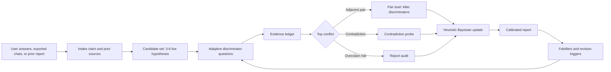
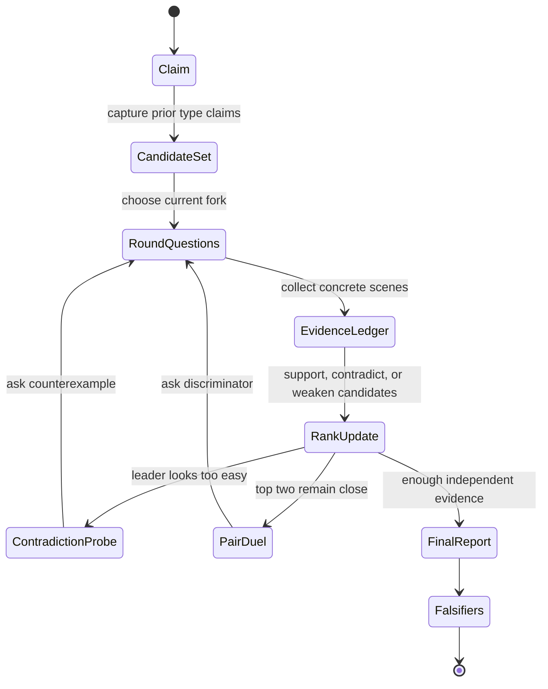
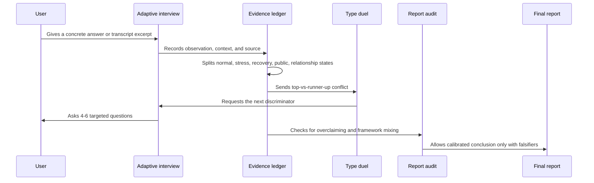
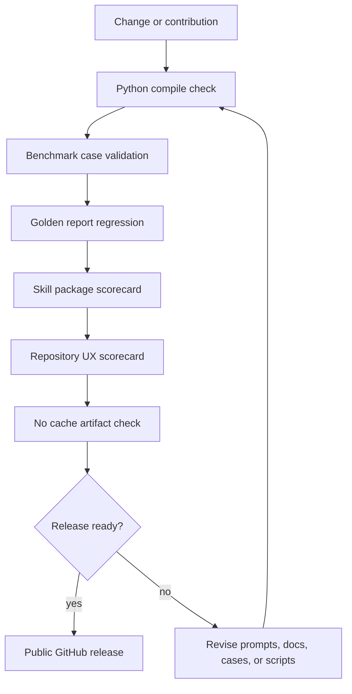
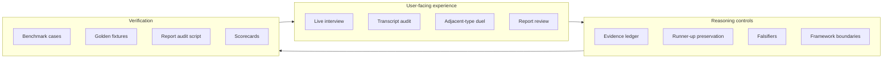

# MBTI Typing Skill

[](https://github.com/Zaoqu-Liu/mbti-typing-skill/actions/workflows/ci.yml)


A rigorous Codex skill for MBTI-style personality typing that treats every type as a falsifiable hypothesis, not a label to be guessed.

This project is built for people who want serious type reasoning: multi-round interviews, transcript audits, adjacent-type duels, evidence ledgers, structured uncertainty, report audits, and regression-tested benchmark cases.

> MBTI can be a useful self-reflection language. It is not a clinical diagnostic instrument, not a hiring tool, and not a way to determine a person's worth or future.

## One-Minute Demo


Start here if you want to feel the product before reading the internals:

- [Visual tour](docs/visual-tour.md): how the repository is meant to be read.
- [Demo session](docs/demo-session.md): a short ENTJ vs INTJ vs INFP example showing the live loop.
- [Sample report](docs/sample-report.md): what a calibrated final answer should look like.
- [Copy-paste prompt recipes](prompts/prompt-recipes.md): six ready-to-use prompts for live typing, duels, transcript audits, and report review.

The experience target is simple: every round should make the user feel that the next question was chosen because of their previous answer, not because the system is walking through a generic quiz.

## Visual System Map



## Why This Exists

Most MBTI workflows fail in predictable ways:

- They overfit one dramatic answer.
- They confuse stress behavior with normal cognition.
- They collapse adjacent types too early.
- They use beautiful prose instead of falsifiable evidence.
- They mix MBTI, Big Five, Enneagram, A/T, attachment, and culture without boundaries.

This skill is designed to prevent those failures. It forces the agent to maintain a candidate set, preserve runner-up types, track contradictions, ask targeted discriminators, and state what would change the conclusion.

## What Makes It Different

- **Mode selector**: live typing, transcript audit, type duel, report review, or protocol design.
- **Evidence ledger**: every claim should connect to observations, alternatives, and caveats.
- **Session state machine**: long interviews can be resumed without losing contradictions.
- **Pair duels**: high-risk type pairs have targeted discriminators and losing conditions.
- **Chinese output style**: sharp, high-retention Chinese updates without flattery or fake certainty.
- **Report audit**: catches missing runner-up, missing evidence, missing falsifiers, overclaiming, and framework mixing.
- **Benchmark suite**: synthetic high-risk cases plus golden good/bad fixtures for regression testing.
- **Self-scorecard**: the skill audits itself and must pass package-level checks.

## Adaptive Typing Loop

The user experience is designed to be sticky through precision, not manipulation. Every round should reveal why the next question exists.



## Evidence Ledger Flow



## Repository Layout

```text
.
  README.md
  README.zh-CN.md
  prompts/
    prompt-recipes.md
  docs/
    visual-tour.md
    demo-session.md
    sample-report.md
    assets/
      mbti-typing-hero.png
      typing-journey-map.png
  examples/
    session-state-example.json
    evidence-ledger-example.md
  skill/mbti-typing/
    SKILL.md
    references/
    examples/
    scripts/
```

## Install

Clone the repository and copy the skill folder into your Codex skills directory:

```bash
git clone https://github.com/Zaoqu-Liu/mbti-typing-skill.git
cp -R mbti-typing-skill/skill/mbti-typing ~/.codex/skills/
```

Then invoke it in Codex:

```text
Use $mbti-typing to run a rigorous multi-round MBTI typing interview.
```

## Quick Start

### Live Typing

```text
Use $mbti-typing. Someone says I am INFP, but I often test ENTJ. Keep asking until the evidence clearly supports or disproves the claim.
```

Expected behavior:

- Build candidate set.
- Ask 4-6 targeted questions per round.
- Preserve runner-up types.
- Update the evidence board after each round.
- End with falsifiers, not fake certainty.

### Type Duel

```text
Use $mbti-typing to distinguish ENTJ vs INTJ. Focus on Te-dom vs Ni-dom, not generic extroversion.
```

### Transcript Audit

```text
Use $mbti-typing to audit these exported conversations and extract the evidence, reversals, overclaims, and best current formulation.
```

### Report Review

```text
Use $mbti-typing to review this MBTI report for unsupported claims, missing differential diagnosis, framework mixing, and overconfidence.
```

## Validation

Run the full local scorecard:

```bash
make test
```

Equivalent direct commands:

```bash
python3 -B skill/mbti-typing/scripts/benchmark_cases.py validate skill/mbti-typing/examples/benchmark-cases.json
python3 -B skill/mbti-typing/scripts/benchmark_cases.py regression skill/mbti-typing/examples/benchmark-cases.json skill/mbti-typing/examples/golden-reports.json
python3 -B skill/mbti-typing/scripts/skill_scorecard.py skill/mbti-typing
```

Expected result:

```text
Score: 35/35 (100.00%)
Regression passed for 8 golden fixtures.
Repository UX Score: 61/61 (100.00%)
```

For the full evaluation model, see [docs/evaluation.md](docs/evaluation.md).

## Quality Gate Pipeline



## Quality Model

A serious final typing must include:

- A leading formulation and a serious runner-up.
- At least two independent discriminators for the top pair.
- Normal-state evidence and stress/recovery/conflict evidence.
- A cross-framework check or an explicit reason to skip it.
- Falsifiers: what would change the conclusion.
- Framework boundaries: what is MBTI, what is Big Five, what is A/T, and what is only an observation.

For the interaction design principles behind the live typing experience, see [docs/experience-principles.md](docs/experience-principles.md).

## Trust Architecture



## Safety Boundaries

Do not use this skill for:

- Clinical diagnosis.
- Hiring, school admission, or selection.
- Legal, medical, or financial decisions.
- Deterministic claims about a person's worth, destiny, or future.

Do use it for:

- Structured self-reflection.
- Better interview questions.
- Evidence-based personality reports.
- Reviewing and improving existing MBTI analyses.
- Learning how to reason about ambiguous personality evidence.

## Contributing

Contributions are welcome if they improve rigor, coverage, safety, or user experience. See [CONTRIBUTING.md](CONTRIBUTING.md).

Good contributions include:

- New benchmark cases with clear traps and expected runner-up types.
- Better pair-duel discriminators.
- Stronger report audit checks.
- More realistic golden fixtures.
- Clearer Chinese or English output templates.

## License

MIT. See [LICENSE](LICENSE).
