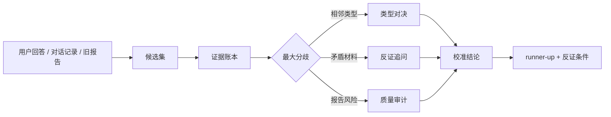

# MBTI Typing Skill


一个严肃的 Codex MBTI 判型 skill。它不靠“神判”和标签感，而是把每个类型当成可证伪假设，用多轮访谈、证据账本、runner-up、反证和回归测试来逼近更可靠的判型。

> MBTI 可以作为自我理解语言，但不能用于临床诊断、招聘筛选、升学筛选、法律判断，不能决定一个人的价值或未来。

## 先看一分钟 Demo


如果你是第一次点进来，推荐按这个顺序看：

- [Visual tour](docs/visual-tour.md)：这个仓库的视觉阅读路径。
- [Demo session](docs/demo-session.md)：一次 ENTJ vs INTJ vs INFP 的短样例会话。
- [Sample report](docs/sample-report.md)：最终报告应该长什么样。

目标不是让用户被漂亮话哄住，而是让用户觉得：每一轮追问都真的接住了上一轮的矛盾。

## 它解决什么问题

普通 MBTI 判型常见问题：

- 单题定型。
- 把压力状态当正常人格。
- ENTJ/INTJ、INFP/INFJ 这种相邻类型过早锁死。
- 用漂亮叙事代替证据链。
- 把 MBTI、Big Five、九型、A/T、依恋、文化背景混成一锅。

这个 skill 强制 agent 做几件事：

- 保留候选集，而不是直接下结论。
- 给每条证据写支持什么、反驳什么、替代解释是什么。
- 保留 runner-up。
- 每轮只攻击当前最关键的不确定性。
- 最终必须写“什么证据会让我改判”。

## 系统长什么样



## 安装

```bash
git clone https://github.com/Zaoqu-Liu/mbti-typing-skill.git
cp -R mbti-typing-skill/skill/mbti-typing ~/.codex/skills/
```

然后在 Codex 中使用：

```text
Use $mbti-typing to run a rigorous multi-round MBTI typing interview.
```

## 典型用法

```text
Use $mbti-typing。别人说我是 INFP，但我经常测出 ENTJ。你持续追问，直到能证实或证伪。
```

```text
Use $mbti-typing 帮我区分 ENTJ vs INTJ，不要泛泛问外向内向，要切 Te-dom vs Ni-dom。
```

```text
Use $mbti-typing 审核这份人格报告，重点看过度自信、循环论证、缺少排除性诊断、框架混用。
```

## 体验原则

它让用户“上瘾”的方式不是奉承，而是：

- 每轮都告诉你候选榜怎么变。
- 每轮只切一个真正关键的分叉。
- 把矛盾当核心材料。
- 允许用户纠错，并用纠错更新模型。
- 最终给出可用洞察，而不是一个死标签。

示例节奏：

```text
这一轮真正有用的是三点：
1. ...
2. ...
3. ...

当前候选榜：
- 第一候选：TYPE。原因：...
- 第二候选：TYPE。原因：...

现在最大的矛盾：
...

下一轮只打一个点：...
```

## 质量验证

```bash
make test
```

会验证：

- skill 文件齐全。
- 16 型覆盖。
- pair duel 数量。
- benchmark cases 合法。
- golden fixtures 回归通过。
- Python 脚本语法通过。
- 没有缓存污染。

当前预期：

```text
Score: 35/35 (100.00%)
Regression passed for 8 golden fixtures.
Repository UX Score: 52/52 (100.00%)
```

完整评估模型见 [docs/evaluation.md](docs/evaluation.md)，交互体验原则见 [docs/experience-principles.md](docs/experience-principles.md)。

## 开源贡献

欢迎贡献：

- 新的误判案例。
- 更锋利的类型对决问题。
- 更强的报告审计规则。
- 更真实的 golden fixtures。
- 更自然、更有穿透力的中文输出模板。

详见 [CONTRIBUTING.md](CONTRIBUTING.md)。
