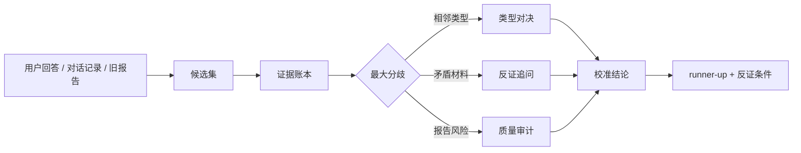

# MBTI Typing Skill


一个严肃的跨 agent MBTI 判型 skill。它不靠“神判”和标签感，而是把每个类型当成可证伪假设，用多轮访谈、证据账本、runner-up、反证和回归测试来逼近更可靠的判型。

GitHub social preview 资产放在 [docs/assets/social-preview.jpg](docs/assets/social-preview.jpg)，这样仓库被转发到 README 之外时也能保留同一套产品信号。

GitHub 产品工作台位图放在 [docs/assets/github-product-command-center.png](docs/assets/github-product-command-center.png)。它用 `imagegen` 生成，只负责产品感和复杂度氛围；精确流程、文字声明和门禁都由 SVG、Markdown 与审计脚本承担。

> MBTI 可以作为自我理解语言，但不能用于临床诊断、招聘筛选、升学筛选、法律判断，不能决定一个人的价值或未来。

## Experience Hub、Session Lab、Question Lab、Type Duel Lab、Agent Adapter Lab、Agent Portability Lab、Benchmark Arena、Benchmark Replay Lab、Calibration Lab、Follow-Up Lab、Response Eval Lab 和 Playground

第一次打开可以先进入 Experience Hub 按任务选入口；已经有材料时，可以直接打开本地优先的 Session Lab：

- [GitHub Pages Experience Hub](https://zaoqu-liu.github.io/mbti-typing-skill/)
- [本地 Experience Hub 文件](docs/index.html)
- [GitHub Pages Session Lab](https://zaoqu-liu.github.io/mbti-typing-skill/session-lab.html)
- [本地 Session Lab 文件](docs/session-lab.html)
- [GitHub Pages Question Lab](https://zaoqu-liu.github.io/mbti-typing-skill/question-lab.html)
- [本地 Question Lab 文件](docs/question-lab.html)
- [GitHub Pages Type Duel Lab](https://zaoqu-liu.github.io/mbti-typing-skill/type-duel-lab.html)
- [本地 Type Duel Lab 文件](docs/type-duel-lab.html)
- [GitHub Pages Agent Adapter Lab](https://zaoqu-liu.github.io/mbti-typing-skill/agent-adapter-lab.html)
- [本地 Agent Adapter Lab 文件](docs/agent-adapter-lab.html)
- [GitHub Pages Agent Portability Lab](https://zaoqu-liu.github.io/mbti-typing-skill/agent-portability-lab.html)
- [本地 Agent Portability Lab 文件](docs/agent-portability-lab.html)
- [GitHub Pages Benchmark Arena](https://zaoqu-liu.github.io/mbti-typing-skill/case-gallery.html)
- [本地 case gallery 文件](docs/case-gallery.html)
- [GitHub Pages Benchmark Replay Lab](https://zaoqu-liu.github.io/mbti-typing-skill/benchmark-replay-lab.html)
- [本地 Benchmark Replay Lab 文件](docs/benchmark-replay-lab.html)
- [GitHub Pages Calibration Lab](https://zaoqu-liu.github.io/mbti-typing-skill/calibration-lab.html)
- [本地 Calibration Lab 文件](docs/calibration-lab.html)
- [GitHub Pages Follow-Up Lab](https://zaoqu-liu.github.io/mbti-typing-skill/follow-up-lab.html)
- [本地 Follow-Up Lab 文件](docs/follow-up-lab.html)
- [GitHub Pages Response Eval Lab](https://zaoqu-liu.github.io/mbti-typing-skill/response-eval-lab.html)
- [本地 Response Eval Lab 文件](docs/response-eval-lab.html)
- [GitHub Pages playground](https://zaoqu-liu.github.io/mbti-typing-skill/playground.html)
- [本地 playground 文件](docs/playground.html)

Experience Hub 会把 Pages 根地址变成任务工作台：按“马上判型、验证结果、研究失败案例、安装到 agent、适配未知 host、贡献证据”分流，并提供可复制 starter prompt 和 Experience Hub Route Map。Session Lab 会把一个判型主张和零散材料转换成启发式候选榜、证据账本、类型对决、下一轮问题、报告草稿、可复制 Codex prompt、share link、Import JSON 恢复入口和 session state export。Question Lab 会把 `question-bank.md` 变成可搜索的 Round Builder，展示 source-synced probes、低打字 `A/B/C/D/E` 选项式提问、4-6 题回合模板、可复制 next-round prompt 和 `question_improvement.yml` issue seed。Type Duel Lab 会把完整的 `pair-duels.md` 变成可搜索的相邻类型对决矩阵，展示 killer questions、losing conditions、可复制 duel prompt 和 `type_duel_improvement.yml` issue seed。Agent Adapter Lab 会把 `agent-adapters/manifest.json` 变成可选择的适配入口，生成 pack command、安装清单、native question UI 与 compact-choice fallback 指引、adapter JSON receipt 和 `agent_adapter_improvement.yml` issue seed。Agent Portability Lab 会把同一个 manifest 变成 capability-first 的 Universal Agent Bridge：面对未知 host，也能先按能力映射生成 portable install recipe、`agent-portability-lab/v1` adapter draft 和 `agent_portability_request.yml` issue seed，而不是凭感觉猜平台格式。Benchmark Arena 是一个 adversarial case gallery，展示误判 trap、runner-up、falsifier、可复用 prompt 和 benchmark issue seed。Benchmark Replay Lab 会把同一批 canonical cases 变成盲测重放界面：隐藏参考答案，先记录 leading、runner-up 和 falsifier guess，再 reveal reference，导出 Replay Receipt JSON、repair prompt 和 `benchmark_replay_improvement.yml` issue seed。Calibration Lab 允许用户粘贴一段判型报告，立刻得到 Calibration Receipt、修复 prompt、JSON receipt 和失败 issue seed。Follow-Up Lab 会把延迟观察转换成同意、脱敏、public-safe 的 JSON packet 和 issue seed。Response Eval Lab 允许用户粘贴任意 MBTI 回答，立刻得到本地质量雷达、choice-first question gate、JSON receipt、修复 prompt 和 `response_eval_improvement.yml` issue seed。Interactive Playground 保留为更快的视觉流程预览。

## 先看一分钟 Demo


如果你是第一次点进来，推荐按这个顺序看：

- [Visual tour](docs/visual-tour.md)：这个仓库的视觉阅读路径。
- [Experience Hub](docs/index.html)：Pages 根入口任务工作台，含 workflow cards、starter prompt 和 route-map visual。
- [Agent adapters](docs/agent-adapters.md)：一等维护的 Core Pack 覆盖 Codex、Claude Code、Cursor、opencode；ChatGPT GPTs/Projects、Zed、Devin、Gemini CLI、GitHub Copilot、Windsurf、Cline、Continue、aider、JetBrains Junie、Amazon Q、Roo Code、Kilo Code 和通用 AGENTS.md-aware agents 作为可选 manifest recipes 保留。
- [Agent pack export](agent-adapters/README.md)：从 manifest 导出可复制到其他仓库的 agent pack，避免手动漏拷 adapter。
- [Agent Adapter Lab](docs/agent-adapter-lab.html)：本地 agent target selector，可复制 pack command、安装清单、adapter JSON receipt 和 adapter issue seed。
- [Agent Portability Lab](docs/agent-portability-lab.html)：面对新 agent 或未知 host 的 capability-first Universal Agent Bridge，可复制 portable install recipe、adapter JSON draft 和 `agent_portability_request.yml` issue seed。
- [Response evaluation fixtures](examples/response-eval-cases.json)：用 live-round、type-duel、final-report 和 anti-pattern 样例审回答质量，而不是只审最终报告格式。
- [Response Eval Lab](docs/response-eval-lab.html)：本地回答质量雷达，可复制修复 prompt、Eval JSON 和 issue seed。
- [Question Lab](docs/question-lab.html)：从 `question-bank.md` 同步而来的下一轮 4-6 题 Round Builder。
- [Type Duel Lab](docs/type-duel-lab.html)：从 `pair-duels.md` 同步而来的相邻类型对决矩阵。
- [Benchmark Arena](docs/case-gallery.html)：用来观察 trap、runner-up、falsifier 的对抗样例库。
- [Benchmark Replay Lab](docs/benchmark-replay-lab.html)：把 benchmark prompt 变成盲测重放，先猜 top-two 和 falsifier，再 reveal reference、复制 repair prompt 或 issue seed。
- [Calibration Lab](docs/calibration-lab.html)：用 blind calibration loop 检查报告是否漏掉 benchmark 预期。
- [Follow-Up Lab](docs/follow-up-lab.html)：用本地隐私门禁生成 consented follow-up JSON 和 issue seed。
- [Blind Review Protocol](docs/blind-review-protocol.md)：用匿名化多评审矩阵检查 top-1、top-2、runner-up、falsifier、boundary 和 overclaim。
- [Consent Redaction Protocol](docs/consent-redaction-protocol.md)：让真实用户的延迟反馈能在同意、脱敏、撤回和最小化暴露的约束下进入项目。
- [Demo session](docs/demo-session.md)：一次 ENTJ vs INTJ vs INFP 的短样例会话。
- [Sample report](docs/sample-report.md)：最终报告应该长什么样。
- [Copy-paste prompt recipes](prompts/prompt-recipes.md)：六个可直接复制的启动 prompt。

目标不是让用户被漂亮话哄住，而是让用户觉得：每一轮追问都真的接住了上一轮的矛盾。交互上也要尽量少打字：只有当 Codex `request_user_input`、Claude Code `AskUserQuestion`、Cursor `AskQuestion` 或其他 native question UI 在当前 host 真实可用时才调用；否则用紧凑 `A/B/C/D/E` 选项，最后一个永远保留 `Other / none of these - I will explain` 作为自由补充入口。

## 产品体验蓝图

这个仓库不是“文件堆”，而是一个可以被第一次访问者快速理解的产品入口：先试、再看证据、再安装、再贡献。

### GitHub Product Command Center


这张图是 GitHub 首屏的产品感补强：它展示复杂工作台、证据流、agent 节点、审计回执和多实验室路径，但刻意不放可读生成文字。真正需要准确的声明都在下面的 SVG、文档和 `scripts/repository_scorecard.py` 里。

### Experience Hub Route Map


Experience Hub Route Map 解释新的 Pages 根入口：[docs/index.html](docs/index.html) 不再只是跳到单一实验室，而是把用户分到判型、验证、benchmark replay、follow-up evidence、agent 安装、future-host portability 和贡献路径。所有路径都保留 candidate set、serious runner-up、evidence ledger、falsifier 和 safety boundary。`scripts/index_hub_audit.py` 会在发布前检查 local-first 渲染、workflow 链接、starter prompt 复制、route-map 可见性、安全边界文案和 DOM 注入风险。

### GitHub UX Flywheel


这张图回答“GitHub 怎么让人愿意继续用”：第一次扫 README、无账号本地试用、看到 proof、安装 Core Pack、带着新证据回来、最后安全贡献 issue。它不是靠身份恭维或假确定性留人，而是靠状态记忆、runner-up 压力和下一题真的命中用户矛盾。

### GitHub Visitor Experience Map


这张图回答“用户第一次点进 GitHub 后该怎么走”：不同访问意图会被路由到 Session Lab、share link、Codex prompt、安装命令或 benchmark 贡献入口。

### MBTI Typing OS Stack


这张图回答“功能做大以后怎么不散”：intake、hypothesis、question、evidence、duel、audit、distribution 和 release gate 分层。用户看到的是一个大而全的 skill；维护上仍然是一套 canonical protocol，而不是每个 agent、每个 lab 各讲一套。

### Typing Engine Blueprint


这张图回答“为什么它不是普通 MBTI 问卷”：16 型始终是候选宇宙，证据先进入 ledger，再进入相邻类型对决、反证门和报告审计。

### Evidence Retention Loop


这张图回答“用户为什么会回来”：每次回来都可能带来一个 contradiction、follow-up observation 或现实中的 miss。系统必须显示 evidence delta、继续压 runner-up、选出下一轮 discriminator，并把重复 miss 变成 benchmark repair；留存来自变准，不来自操控。

### Trust Loop Dashboard


这张图回答“为什么这个开源项目会越用越准”：真实误判会变成 benchmark，benchmark 进入回归测试，测试结果再约束 GitHub Pages、Release 和 README 首屏体验。

### Benchmark Arena Pipeline


这张图回答“为什么公开 case gallery 不会和 benchmark 数据漂移”：`skill/mbti-typing/examples/benchmark-cases.json` 是唯一源头，`scripts/sync_case_gallery.py` 做 source-of-truth sync，`docs/case-gallery.html` 只展示同步后的数据，测试门禁会检查两边完全一致。

### Benchmark Replay Loop


这张图回答“怎么让 benchmark 变成用户愿意反复玩的训练场”：`scripts/sync_benchmark_replay_lab.py` 把 canonical cases 同步进 `docs/benchmark-replay-lab.html`，用户先复制 blind prompt，记录 leading type、runner-up 和 falsifier guess，再 reveal reference，导出 Replay Receipt、repair prompt 或 `benchmark_replay_improvement.yml` issue seed。`scripts/benchmark_replay_lab_audit.py` 会在发布前检查 source sync、DOM 安全、复制输出和安全边界。

### Benchmark Type Coverage Matrix


这张图回答“是不是 16 型都真的被测到了”：扩展后的 benchmark suite 已经让 16 个 MBTI type code 都至少作为 leading hypothesis 出现一次。16 / 16 covered 不是心理测量真值声明，而是说明每个类型都有对应的 runner-up、trap、evidence tags 和 falsifier theme。

### Calibration Loop Map


这张图回答“为什么用户会反复回来用”：用户粘贴判型报告，经过可见校准门，拿到 Calibration Receipt、修复 prompt 和 `calibration_result.yml` issue seed。允许的粘性来自更精准的反馈闭环，而不是假确定性或身份操控。

### Blind Review Arena


这张图回答“怎么证明它不是自嗨”：把样例包匿名化并隐藏参考答案，让不同 reviewer 或模型独立输出 leading、runner-up、证据标签、falsifier 和边界声明，再由 `examples/blind-review-matrix.json` 和 `scripts/blind_review_audit.py` 汇总 top-1、top-2、runner-up 保存率和 overclaim 风险。

### Consent Feedback Loop


这张图回答“真实用户材料怎么安全进入开源项目”：`docs/consent-redaction-protocol.md` 定义同意、脱敏、撤回和最小化暴露要求，`examples/consented-followup-packet.json` 提供可审计样例，`.github/ISSUE_TEMPLATE/consented_followup.yml` 给贡献者结构化入口，`scripts/consent_redaction_audit.py` 把 raw private chat、直接标识符、第三方细节和缺失反馈挡在 release 之前。

### Adaptive Question Loop


这张图回答“下一轮到底该问什么才不泛”：`skill/mbti-typing/references/question-bank.md` 是源头，`scripts/sync_question_lab.py` 把 Markdown probe 同步到 `docs/question-lab.html`，用户可以复制 `$mbti-typing` round prompt 或 `question_improvement.yml` issue seed，`scripts/question_lab_audit.py` 会在 release 前检查页面没有和源文件漂移，也没有变成普通人格问卷。

### Type Duel Decision Map


这张图回答“相邻类型到底怎么判才不会乱”：`skill/mbti-typing/references/pair-duels.md` 是源头，`scripts/sync_type_duel_lab.py` 把 Markdown 同步到 `docs/type-duel-lab.html`，用户可以复制 `$mbti-typing` duel prompt 或 `type_duel_improvement.yml` issue seed，`scripts/type_duel_lab_audit.py` 会在 release 前检查页面没有和源文件漂移。

### Agent Adapter Matrix


这张图回答“为什么它不只是 Codex skill”：`AGENTS.md`、`.claude/skills/mbti-typing/SKILL.md`、`.claude/commands/mbti-type.md`、`.cursor/rules/mbti-typing.mdc`、`opencode.json` 和 `agent-adapters/manifest.json` 都指回同一个 canonical skill。`scripts/agent_adapter_audit.py` 会检查 Codex、Claude Code、Cursor、opencode 和通用 AGENTS.md-aware agents 没有丢掉 runner-up、falsifier、evidence ledger 和安全边界。

### Agent Compatibility Grid


这张图回答“主流 agent 工具怎么接入但不变成维护灾难”：一等维护面收敛为 Core Pack：Codex、Claude Code、Cursor、opencode；通用 AGENTS.md-aware agents 和其他 host-specific 文件作为 manifest 里的可选 recipe，团队需要时再导出。扩展 recipe 仍覆盖 ChatGPT GPTs/Projects、Zed、Devin、Gemini CLI、GitHub Copilot、Windsurf、Cline、Continue、aider、JetBrains Junie、Amazon Q、Roo Code 和 Kilo Code，但它们不能把判型流程 fork 成另一套协议。

### Agent Pack Export Flow


这张图回答“怎么把这套东西带到别的仓库”：`scripts/export_agent_pack.py` 会读取 `agent-adapters/manifest.json`，默认可以用 `--target core` 导出一等维护的 Core Pack，也支持有意识地 `--target all` 或 `--target cursor --target cline` 这种精简导出，自动带上 canonical `skill/mbti-typing/`、adapter 文档、prompt recipes、选中的 agent 入口，并生成 `AGENT_PACK_MANIFEST.json` 作为导出回执。`scripts/agent_pack_export_audit.py` 会检查 core export、dry-run JSON、全量导出、选择性导出、非空目录写入保护、未知 target 报错和必要文件存在。这样跨 agent 适配不是 README 里的手工清单，而是可复制、可审计的产品包。

### Agent Adapter Lab Flow


这张图回答“普通用户怎么知道自己的 agent 能不能用”：打开 [Agent Adapter Lab](docs/agent-adapter-lab.html)，选择 Codex、Claude Code、Cursor、opencode 或其他目标，复制 pack command、安装清单、adapter JSON receipt，遇到缺失或过时入口时生成 `agent_adapter_improvement.yml` issue seed。`scripts/sync_agent_adapter_lab.py` 保证页面数据来自 `agent-adapters/manifest.json`，`scripts/agent_adapter_lab_audit.py` 会在发布前拦住 manifest 漂移、缺少复制输出、DOM 注入风险和安全边界缺失。

### Universal Agent Bridge Map


这张图回答“下一个主流 agent 还没写 adapter 时怎么办”：打开 [Agent Portability Lab](docs/agent-portability-lab.html)，选择已知 target 或输入 unknown host，勾选它真实支持的能力：project instruction file、native `SKILL.md` directory、project rule/mode file、custom agent JSON/profile、slash command、chat project instructions 或 config instruction array。页面会生成 bridge plan、portable install recipe、`agent-portability-lab/v1` adapter draft 和 `agent_portability_request.yml` issue seed。`scripts/sync_agent_portability_lab.py` 保证页面数据来自 `agent-adapters/manifest.json`，`scripts/agent_portability_lab_audit.py` 会在发布前拦住 capability 漂移、复制输出缺失、DOM 注入风险和安全边界缺失。

### Response Quality Radar


这张图回答“实际回答是不是足够让用户继续用”：`examples/response-eval-cases.json` 覆盖 live round、type duel、final report 和 anti-pattern，`scripts/response_eval_audit.py` 会检查 candidate set、serious runner-up、evidence movement、下一轮 4-6 个具体问题、falsifier、安全边界、校准信心和 Anti-Flattery。buildless 的 [Response Eval Lab](docs/response-eval-lab.html) 把这件事变成用户入口：粘贴任意回答，查看 mode-aware radar，复制修复 prompt，导出 JSON，或生成 `response_eval_improvement.yml` issue seed。release 前必须看到 `Response Eval Audit`、`Response Eval Lab Audit` 都是 100%，并且 `negative_blocked` 为 1/1。也就是说，粘性来自 sticky precision，不是 100% 神判、奉承或身份锁定。

### Response Eval Command Center


这张图是 Response Eval Lab 的产品目标：回答卡片、质量门、雷达、issue 路径和审计回执必须同时可见。它是无可读 UI 文本的生成位图，用来给 GitHub 首屏和分享场景提供产品感；精确声明由下面的 SVG 和审计脚本承担。

### Response Eval Lab Flow


这张图把用户留存路径拆开：粘贴回答，选择 mode-aware gates，看 quality radar，复制 JSON receipt、repair prompt 或 `response_eval_improvement.yml` issue seed，再由 `scripts/response_eval_lab_audit.py` 保证页面仍然 local-first、DOM-safe、可发布。这是回答质量层对应的 benchmark/calibration 闭环。

## 它解决什么问题

普通 MBTI 判型常见问题：

- 单题定型。
- 把压力状态当正常人格。
- ENTJ/INTJ、INFP/INFJ 这种相邻类型过早锁死。
- 用漂亮叙事代替证据链。
- 把 MBTI、Big Five、九型、A/T、依恋、文化背景混成一锅。

这个 skill 强制 agent 做几件事：

- 保留候选集，而不是直接下结论。
- 给每条证据写支持什么、反驳什么、替代解释是什么。
- 保留 runner-up。
- 每轮只攻击当前最关键的不确定性。
- 最终必须写“什么证据会让我改判”。

## 系统长什么样



## 安装

```bash
git clone https://github.com/Zaoqu-Liu/mbti-typing-skill.git
cp -R mbti-typing-skill/skill/mbti-typing ~/.codex/skills/
```

然后在 Codex 中使用：

```text
Use $mbti-typing to run a rigorous multi-round MBTI typing interview.
```

## 典型用法

```text
Use $mbti-typing。别人说我是 INFP，但我经常测出 ENTJ。你持续追问，直到能证实或证伪。
```

```text
Use $mbti-typing 帮我区分 ENTJ vs INTJ，不要泛泛问外向内向，要切 Te-dom vs Ni-dom。
```

```text
Use $mbti-typing 审核这份人格报告，重点看过度自信、循环论证、缺少排除性诊断、框架混用。
```

## 体验原则

它让用户“上瘾”的方式不是奉承，而是：

- 每轮都告诉你候选榜怎么变。
- 每轮只切一个真正关键的分叉。
- 把矛盾当核心材料。
- 允许用户纠错，并用纠错更新模型。
- 最终给出可用洞察，而不是一个死标签。

示例节奏：

```text
这一轮真正有用的是三点：
1. ...
2. ...
3. ...

当前候选榜：
- 第一候选：TYPE。原因：...
- 第二候选：TYPE。原因：...

现在最大的矛盾：
...

下一轮只打一个点：...
```

## 质量验证

```bash
make test
```

会验证：

- skill 文件齐全。
- 16 型覆盖。
- pair duel 数量。
- benchmark cases 合法。
- case gallery 和 benchmark JSON 完全同步。
- benchmark replay lab 和 benchmark JSON 完全同步，并能生成 blind prompt、Replay Receipt、repair prompt 和 issue seed。
- calibration lab 和 benchmark JSON 完全同步。
- follow-up lab 能本地生成脱敏回访 JSON 和 issue seed。
- question lab 和 `question-bank.md` 完全同步。
- blind review matrix 可以被审计并输出可见指标。
- consented follow-up packet 必须通过同意、脱敏、隐私和反馈门禁。
- agent pack export 能从 manifest 导出全量或选择性适配包。
- agent adapter lab 和 manifest 完全同步，并能生成 pack command、安装清单、JSON receipt 和 issue seed。
- response eval 能拦住 100% 神判、奉承、无 runner-up、无反证的坏回答。
- response eval lab 能本地审任意回答并生成修复 prompt、Eval JSON 和 issue seed。
- golden fixtures 回归通过。
- Python 脚本语法通过。
- 没有缓存污染。

当前预期：

```text
Score: 35/35 (100.00%)
Regression passed for 16 golden fixtures.
Session Lab Audit: 61/61 (100.00%)
Blind Review Audit: 93/93 (100.00%)
Blind Review Metrics: top1: 5/6 (83.33%); top2: 6/6 (100.00%)
Consent Redaction Audit: 78/78 (100.00%)
Consent Redaction Metrics: packets=2; observations=6; states=5; privacy_safe=2/2; feedback=2/2
Agent Adapter Audit: 339/339 (100.00%)
Agent Pack Export Audit: 28/28 (100.00%)
Agent Adapter Lab Source Sync: PASS (18 targets match)
Agent Adapter Lab Audit: 98/98 (100.00%)
Agent Portability Lab Source Sync: PASS (18 targets, 7 capabilities match)
Agent Portability Lab Audit: 95/95 (100.00%)
Index Hub Audit: 82/82 (100.00%)
Response Eval Audit: 46/46 (100.00%)
Response Eval Metrics: cases=4; positive_pass: 3/3 (100.00%); negative_blocked: 1/1 (100.00%); sticky_precision: 3/3 (100.00%); next_round: 3/3 (100.00%); no_overclaim: 3/3 (100.00%)
Response Eval Lab Audit: 71/71 (100.00%)
Question Lab Source Sync: PASS (21 cards match)
Question Lab Audit: 74/74 (100.00%)
Type Duel Lab Source Sync: PASS (20 duels match)
Type Duel Lab Audit: 68/68 (100.00%)
Case Gallery Source Sync: PASS (16 cases match)
Case Gallery Audit: 48/48 (100.00%)
Benchmark Replay Lab Source Sync: PASS (16 cases match)
Benchmark Replay Lab Audit: 62/62 (100.00%)
Calibration Lab Source Sync: PASS (16 cases match)
Calibration Lab Audit: 53/53 (100.00%)
Follow-Up Lab Audit: 61/61 (100.00%)
Repository UX Score: 678/678 (100.00%)
```

完整评估模型见 [docs/evaluation.md](docs/evaluation.md)，交互体验原则见 [docs/experience-principles.md](docs/experience-principles.md)。

## 开源贡献

欢迎贡献：

- 新的误判案例。
- 更锋利的类型对决问题。
- 更强的报告审计规则。
- 更真实的 golden fixtures。
- 更自然、更有穿透力的中文输出模板。

详见 [CONTRIBUTING.md](CONTRIBUTING.md)。
