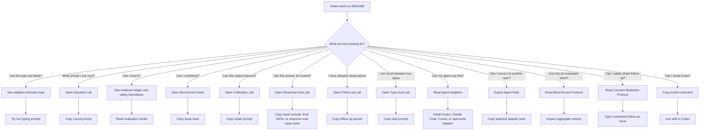

# GitHub UX Design

This repository is designed as a product experience, not just a file dump.

The first-time visitor should understand three things in the first 30 seconds:

- This is a serious evidence-based typing system, not a personality horoscope.
- It has a concrete workflow: interview, candidate set, evidence ledger, type duel, audit, benchmark.
- The project can be trusted because its claims are backed by tests, scorecards, and boundaries.

## First-Screen Strategy

The README opens with:

- A badge row for immediate operational credibility.
- A large visual hero that shows the system as a command center.
- A GitHub social preview asset at `docs/assets/social-preview.jpg` so the same product signal survives link sharing outside the README.
- A local-first Session Lab for visitors who want to paste their own evidence, get a usable next round immediately, copy a share link, and recover work through imported JSON.
- A Question Lab for visitors who want the exact source-synced next 4-6 questions instead of a generic personality quiz restart.
- A Type Duel Lab for visitors who are stuck between two nearby types and want the exact source-synced discriminator, losing conditions, prompt, and improvement seed.
- A Benchmark Arena case gallery for visitors who want to inspect traps, runner-ups, falsifiers, reusable prompts, and contribution seeds.
- A Calibration Lab for visitors who want to paste a report, see failed gates, copy a repair prompt, and turn misses into calibration issues.
- A Follow-Up Lab for visitors who came back days later and need to turn delayed observations into a consented, redacted, public-safe packet.
- Agent adapters for visitors who want the same protocol in Codex, Claude Code, Cursor, opencode, Gemini CLI, GitHub Copilot, Windsurf, Cline, Continue, aider, or another AGENTS.md-aware agent.
- Agent pack export for visitors who want to copy selected adapters into another repository without hand-maintained file lists.
- Response Eval Lab for visitors who want to paste any answer, see quality gates, copy a repair prompt, export JSON, and create a response eval issue seed.
- Response Eval fixtures for visitors who want proof that answer quality is tested for candidate set, runner-up, evidence movement, next questions, falsifiers, safety boundaries, and Anti-Flattery discipline.
- A Blind Review Protocol for visitors who want to see how multi-reviewer or multi-model outputs are evaluated without showing the expected answer up front.
- A Consent Redaction Protocol for visitors who want to contribute delayed real-world observations without exposing private chat logs, identifiers, or third-party details.
- A static interactive playground for visitors who want to try the loop before installing anything.
- A one-minute demo path that links to a visual tour, demo session, and sample report.
- Fifteen SVG blueprints that make the GitHub experience inspectable: `docs/assets/repository-experience-map.svg`, `docs/assets/typing-engine-blueprint.svg`, `docs/assets/trust-loop-dashboard.svg`, `docs/assets/benchmark-arena-pipeline.svg`, `docs/assets/type-coverage-matrix.svg`, `docs/assets/calibration-loop-map.svg`, `docs/assets/blind-review-arena.svg`, `docs/assets/consent-feedback-loop.svg`, `docs/assets/adaptive-question-loop.svg`, `docs/assets/type-duel-decision-map.svg`, `docs/assets/agent-adapter-matrix.svg`, `docs/assets/agent-compatibility-grid.svg`, `docs/assets/agent-pack-export-flow.svg`, `docs/assets/response-quality-radar.svg`, and `docs/assets/response-eval-lab-flow.svg`.
- A short promise that explains the core product difference.
- A quick trust statement that prevents misuse.

The hero is intentionally visual rather than text-heavy. Generated text inside images often looks broken, so the project image uses abstract panels, charts, nodes, and evidence flows instead of readable UI copy.

The SVG blueprints carry precise labels because they are repository-native, reviewable, and stable under version control. Use generated bitmap images for atmosphere and product feel; use SVG for exact workflows, gates, and trust claims.

## Visitor Journey



## Visual Hierarchy

1. Hero image: emotional hook and product shape.
2. Session Lab links: immediate proof that the repo is usable.
3. Question Lab: visible next-round questions, round prompts, and question improvement seeds.
4. Type Duel Lab: visible adjacent-type forks and copyable duel prompts.
5. Benchmark Arena: visible traps and contribution path.
6. Calibration Lab: visible repair loop for failed reports.
7. Follow-Up Lab: safe return path for delayed observations.
8. GitHub Visitor Experience Map: how different visitors should move.
9. Typing Engine Blueprint: why the reasoning loop is not a quiz.
10. Trust Loop Dashboard: why accuracy work is repeatable.
11. Benchmark Arena Pipeline: why public benchmark cases cannot drift from JSON.
12. Benchmark Type Coverage Matrix: why all 16 leading types are now represented.
13. Calibration Loop Map: why failed reports turn into repair prompts and issue seeds.
14. Blind Review Arena: why accuracy claims can be blinded, scored, and adjudicated.
15. Consent Feedback Loop: why real user follow-up can improve the project without exposing raw private material.
16. Adaptive Question Loop: why next-round questions cannot drift from the skill source.
17. Type Duel Decision Map: why pair-duel pages cannot drift from the skill source.
18. Agent Adapter Matrix: why Codex, Claude Code, Cursor, opencode, and AGENTS.md-aware agents share one protocol.
19. Agent Compatibility Grid: why Gemini CLI, GitHub Copilot, Windsurf, Cline, Continue, and aider also route to the same protocol.
20. Agent Pack Export Flow: why adapters can be copied into a target repo from the manifest without manual drift.
21. Response Quality Radar: why generated answers must preserve candidate set, runner-up, evidence movement, next questions, falsifier, safety boundary, and Anti-Flattery gates.
22. Response Eval Command Center: why answer-level audit should feel like a usable product, not only a fixture.
23. Response Eval Lab Flow: why paste-answer, mode-aware gates, quality radar, repair prompt, JSON receipt, and `response_eval_improvement.yml` issue seed form one loop.
24. System map: how inputs become calibrated outputs.
25. Interview loop: why each round feels progressive.
26. Evidence ledger: why the answer is not a black box.
27. Quality gates: why the project is maintainable.

## Experience Promise

The experience should feel sticky because each round makes the user think:

```text
That question was chosen for me.
The system noticed my contradiction.
The runner-up explanation is being treated seriously.
I can see exactly what would change the conclusion.
```

The experience should never rely on:

- Fake certainty.
- Flattery.
- Fear-based identity hooks.
- Endless questioning without state updates.

## README Maintenance Rules

- Keep at least one strong bitmap hero image in `docs/assets/`.
- Keep a second journey-map visual in `docs/assets/`.
- Keep the GitHub social preview asset in `docs/assets/social-preview.jpg`.
- Keep the Response Eval command-center bitmap in `docs/assets/response-eval-command-center.png`.
- Keep the fifteen precise SVG blueprints in `docs/assets/`: `repository-experience-map.svg`, `typing-engine-blueprint.svg`, `trust-loop-dashboard.svg`, `benchmark-arena-pipeline.svg`, `type-coverage-matrix.svg`, `calibration-loop-map.svg`, `blind-review-arena.svg`, `consent-feedback-loop.svg`, `adaptive-question-loop.svg`, `type-duel-decision-map.svg`, `agent-adapter-matrix.svg`, `agent-compatibility-grid.svg`, `agent-pack-export-flow.svg`, `response-quality-radar.svg`, and `response-eval-lab-flow.svg`.
- Keep `AGENTS.md`, `CLAUDE.md`, `GEMINI.md`, `CONVENTIONS.md`, `opencode.json`, `.aider.conf.yml`, `.gemini/settings.json`, `.claude/skills/mbti-typing/SKILL.md`, `.claude/commands/mbti-type.md`, `.cursor/rules/mbti-typing.mdc`, `.github/copilot-instructions.md`, `.github/instructions/mbti-typing.instructions.md`, `.github/skills/mbti-typing/SKILL.md`, `.windsurf/rules/mbti-typing.md`, `.cline/skills/mbti-typing/SKILL.md`, `.clinerules/mbti-typing.md`, `.continue/rules/mbti-typing.md`, `agent-adapters/manifest.json`, `docs/agent-adapters.md`, and `scripts/agent_adapter_audit.py` aligned so adapter portability remains a tested feature, not a claim.
- Keep `scripts/export_agent_pack.py`, `scripts/agent_pack_export_audit.py`, `agent-adapters/manifest.json`, and `docs/assets/agent-pack-export-flow.svg` aligned so adapter portability remains a copyable product path, not only a documentation claim.
- Keep `examples/response-eval-cases.json`, `scripts/response_eval_audit.py`, `docs/response-eval-lab.html`, `scripts/response_eval_lab_audit.py`, `.github/ISSUE_TEMPLATE/response_eval_improvement.yml`, `docs/assets/response-quality-radar.svg`, and `docs/assets/response-eval-lab-flow.svg` aligned so answer-level quality remains a tested UX gate, not only a prose preference.
- Keep `docs/session-lab.html` usable without a build step, external JavaScript, network calls, or account setup; preserve share links, JSON import, and local persistence.
- Keep `docs/question-lab.html` usable without a build step, external runtime, network calls, or account setup; preserve source-of-truth sync from `skill/mbti-typing/references/question-bank.md`, search, category filters, all current question cards, copyable round prompts, issue seed copy, local persistence, and safety boundaries.
- Keep `docs/type-duel-lab.html` usable without a build step, external runtime, network calls, or account setup; preserve source-of-truth sync from `skill/mbti-typing/references/pair-duels.md`, search, cluster filters, all current pair duels, copyable duel prompts, issue seed copy, local persistence, and safety boundaries.
- Keep `docs/case-gallery.html` usable without a build step or external runtime; preserve case filters, prompt copy, issue seed copy, all current benchmark cases, source-of-truth sync from `skill/mbti-typing/examples/benchmark-cases.json`, and safety boundaries.
- Keep `docs/calibration-lab.html` usable without a build step, external runtime, network calls, or account setup; preserve report paste, visible gates, Calibration Receipt, repair prompt, JSON receipt, issue seed copy, source-of-truth sync, and safety boundaries.
- Keep `docs/follow-up-lab.html` usable without a build step, external runtime, network calls, or account setup; preserve consent checkboxes, redaction placeholders, privacy gate, JSON packet copy/download, local persistence, and consented follow-up issue seed copy.
- Keep `docs/blind-review-protocol.md`, `examples/blind-review-matrix.json`, and `scripts/blind_review_audit.py` aligned so blind review claims remain auditable and not just prose.
- Keep `docs/consent-redaction-protocol.md`, `examples/consented-followup-packet.json`, `.github/ISSUE_TEMPLATE/consented_followup.yml`, and `scripts/consent_redaction_audit.py` aligned so real-user follow-up claims remain consented, redacted, withdrawable, and auditable.
- Keep `docs/playground.html` usable without a build step, external JavaScript, or network calls.
- Keep public README and prompt recipe buttons pointing to GitHub repository URLs; parent-directory links break after GitHub Pages deploys the `docs/` folder.
- Keep at least four Mermaid diagrams in the English README.
- Keep demo session and sample report links visible in the first half of the README.
- Keep the Chinese README visually connected to the same hero.
- Do not hide caveats at the bottom; safety boundaries should be visible.
- Every major visual claim should map to a script, reference file, benchmark, or quality gate.
