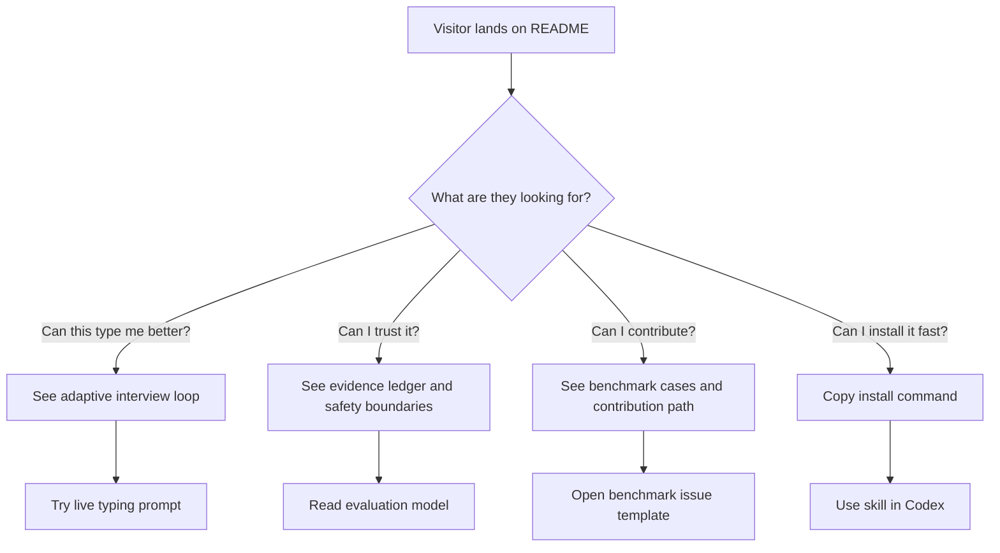

# GitHub UX Design

This repository is designed as a product experience, not just a file dump.

The first-time visitor should understand three things in the first 30 seconds:

- This is a serious evidence-based typing system, not a personality horoscope.
- It has a concrete workflow: interview, candidate set, evidence ledger, type duel, audit, benchmark.
- The project can be trusted because its claims are backed by tests, scorecards, and boundaries.

## First-Screen Strategy

The README opens with:

- A badge row for immediate operational credibility.
- A large visual hero that shows the system as a command center.
- A local-first Session Lab for visitors who want to paste their own evidence and get a usable next round immediately.
- A static interactive playground for visitors who want to try the loop before installing anything.
- A one-minute demo path that links to a visual tour, demo session, and sample report.
- A short promise that explains the core product difference.
- A quick trust statement that prevents misuse.

The hero is intentionally visual rather than text-heavy. Generated text inside images often looks broken, so the project image uses abstract panels, charts, nodes, and evidence flows instead of readable UI copy.

## Visitor Journey



## Visual Hierarchy

1. Hero image: emotional hook and product shape.
2. System map: how inputs become calibrated outputs.
3. Interview loop: why each round feels progressive.
4. Evidence ledger: why the answer is not a black box.
5. Quality gates: why the project is maintainable.

## Experience Promise

The experience should feel sticky because each round makes the user think:

```text
That question was chosen for me.
The system noticed my contradiction.
The runner-up explanation is being treated seriously.
I can see exactly what would change the conclusion.
```

The experience should never rely on:

- Fake certainty.
- Flattery.
- Fear-based identity hooks.
- Endless questioning without state updates.

## README Maintenance Rules

- Keep at least one strong bitmap hero image in `docs/assets/`.
- Keep a second journey-map visual in `docs/assets/`.
- Keep `docs/session-lab.html` usable without a build step, external JavaScript, network calls, or account setup.
- Keep `docs/playground.html` usable without a build step, external JavaScript, or network calls.
- Keep at least four Mermaid diagrams in the English README.
- Keep demo session and sample report links visible in the first half of the README.
- Keep the Chinese README visually connected to the same hero.
- Do not hide caveats at the bottom; safety boundaries should be visible.
- Every major visual claim should map to a script, reference file, benchmark, or quality gate.
