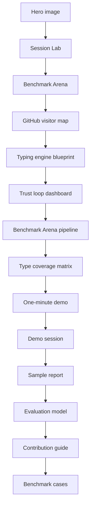

# Visual Tour

This page explains the repository as a user experience. It is meant for visitors who want to understand the product shape before reading the implementation details.

## Command Center

The hero image frames the skill as a reasoning system:

- Candidate type cards stay visible instead of collapsing into one label.
- Evidence tokens flow into a ledger instead of disappearing into prose.
- Adjacent-type duels are separated from generic trait questions.
- Calibration, report audit, and benchmark checks are part of the same loop.

## Journey Map

The journey map shows the experience loop:

1. A user enters with a claim, contradiction, or old report.
2. The system keeps several candidate hypotheses alive.
3. Each answer moves through a ledger, not a vibe check.
4. Contradictions become targeted questions.
5. The top pair enters a focused duel.
6. The final report includes runner-up types, falsifiers, and revision triggers.
7. The user leaves with observation prompts, so the result can improve over time.

## GitHub Visitor Experience Map

This blueprint is for repository design, not personality theory. It shows how the GitHub page routes different first-time visitors:

- Someone who wants to be typed can open Session Lab before installing anything.
- Someone who wants proof can see tests, scorecards, caveats, and local-first behavior.
- Someone ready to install can copy the commands without digging through internals.
- Someone with a failure case can turn it into a benchmark contribution.

The map keeps the most important UX promise visible: the fastest path is still evidence-based.

## Typing Engine Blueprint

This is the reasoning architecture behind the experience:

- The full 16-type universe stays available.
- The candidate set is a live hypothesis board, not a final answer.
- Every useful observation must pass through the evidence ledger.
- Adjacent-type duels are separate from generic trait questions.
- Reports are not trusted until falsifiers and framework boundaries are visible.

## Trust Loop Dashboard

The dashboard explains why the repository can keep improving after release:

- Real user ambiguity enters through Session Lab, transcripts, and failure reports.
- Repeated failures become benchmark cases or golden fixtures.
- `make test` ties the skill scorecard, Session Lab audit, report audit, and repository UX scorecard together.
- GitHub Pages and releases expose the result back to first-time users.

## Benchmark Arena Pipeline

The pipeline explains why the public case gallery can stay trustworthy as the benchmark suite grows:

- `skill/mbti-typing/examples/benchmark-cases.json` is the canonical case source.
- `scripts/sync_case_gallery.py` writes the generated page data into `case-gallery.html`.
- The Case Gallery audit compares the embedded page data back against the JSON before release.
- Issue seed feedback returns new failures to the benchmark source instead of leaving them as anecdotes.

## Benchmark Type Coverage Matrix

The matrix makes coverage visible instead of implicit:

- All 16 MBTI type codes appear as leading hypotheses.
- Every tile maps to a benchmark case id, not a decorative label.
- Coverage is paired with traps and falsifiers, so the matrix does not become a type-collection trophy.

## Session Lab

The fastest product path is now [Session Lab](session-lab.html):

1. Paste a claim and messy notes.
2. Run a local heuristic triage.
3. Inspect the candidate board, evidence ledger, focused duels, and next questions.
4. Copy the generated Codex prompt, copy a share link, import edited JSON, or export the session state JSON.

The lab is intentionally local-first: no build step, no external runtime, no account, and no network call. Share links use a URL hash so the browser can recover a session without sending the evidence to a server.

## Benchmark Arena

[Benchmark Arena](case-gallery.html) turns the regression suite into a product surface:

- Visitors can scan eight adversarial cases before trusting the workflow.
- Each case shows the leading type, serious runner-up, trap, required evidence tags, and strongest falsifier.
- The page generates a reusable `Use $mbti-typing` benchmark prompt.
- The issue seed makes a failed typing session easy to convert into a new synthetic benchmark.

This is the retention loop that is allowed: users come back because the system makes mistakes inspectable and harder to repeat.

## Why These Visuals Matter

Most personality tools make the result feel magical. This project should make the reasoning feel visible.

The visual system therefore emphasizes:

- State: the user can see where the investigation is.
- Motion: each round should move the candidate set.
- Friction: contradictions are not hidden.
- Calibration: a result can be useful without pretending to be final.

## Repository Reading Path

If a visitor only reads one path, this is the intended path.
