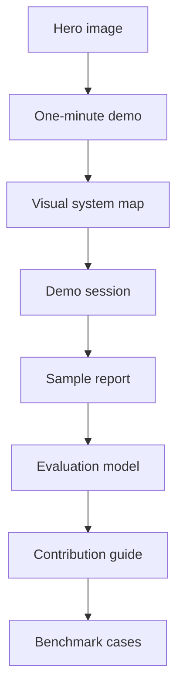

# Visual Tour

This page explains the repository as a user experience. It is meant for visitors who want to understand the product shape before reading the implementation details.

## Command Center

The hero image frames the skill as a reasoning system:

- Candidate type cards stay visible instead of collapsing into one label.
- Evidence tokens flow into a ledger instead of disappearing into prose.
- Adjacent-type duels are separated from generic trait questions.
- Calibration, report audit, and benchmark checks are part of the same loop.

## Journey Map

The journey map shows the experience loop:

1. A user enters with a claim, contradiction, or old report.
2. The system keeps several candidate hypotheses alive.
3. Each answer moves through a ledger, not a vibe check.
4. Contradictions become targeted questions.
5. The top pair enters a focused duel.
6. The final report includes runner-up types, falsifiers, and revision triggers.
7. The user leaves with observation prompts, so the result can improve over time.

## Why These Visuals Matter

Most personality tools make the result feel magical. This project should make the reasoning feel visible.

The visual system therefore emphasizes:

- State: the user can see where the investigation is.
- Motion: each round should move the candidate set.
- Friction: contradictions are not hidden.
- Calibration: a result can be useful without pretending to be final.

## Repository Reading Path

If a visitor only reads one path, this is the intended path.

