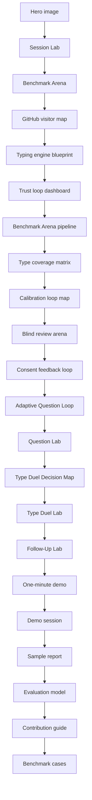

# Visual Tour

This page explains the repository as a user experience. It is meant for visitors who want to understand the product shape before reading the implementation details.

## Command Center

The hero image frames the skill as a reasoning system:

- Candidate type cards stay visible instead of collapsing into one label.
- Evidence tokens flow into a ledger instead of disappearing into prose.
- Adjacent-type duels are separated from generic trait questions.
- Calibration, report audit, and benchmark checks are part of the same loop.

## Journey Map

The journey map shows the experience loop:

1. A user enters with a claim, contradiction, or old report.
2. The system keeps several candidate hypotheses alive.
3. Each answer moves through a ledger, not a vibe check.
4. Contradictions become targeted questions.
5. The top pair enters a focused duel.
6. The final report includes runner-up types, falsifiers, and revision triggers.
7. The user leaves with observation prompts, so the result can improve over time.

## GitHub Visitor Experience Map

This blueprint is for repository design, not personality theory. It shows how the GitHub page routes different first-time visitors:

- Someone who wants to be typed can open Session Lab before installing anything.
- Someone who wants proof can see tests, scorecards, caveats, and local-first behavior.
- Someone ready to install can copy the commands without digging through internals.
- Someone with a failure case can turn it into a benchmark contribution.

The map keeps the most important UX promise visible: the fastest path is still evidence-based.

## Typing Engine Blueprint

This is the reasoning architecture behind the experience:

- The full 16-type universe stays available.
- The candidate set is a live hypothesis board, not a final answer.
- Every useful observation must pass through the evidence ledger.
- Adjacent-type duels are separate from generic trait questions.
- Reports are not trusted until falsifiers and framework boundaries are visible.

## Trust Loop Dashboard

The dashboard explains why the repository can keep improving after release:

- Real user ambiguity enters through Session Lab, transcripts, and failure reports.
- Repeated failures become benchmark cases or golden fixtures.
- `make test` ties the skill scorecard, Session Lab audit, Question Lab audit, Type Duel Lab audit, report audit, and repository UX scorecard together.
- GitHub Pages and releases expose the result back to first-time users.

## Benchmark Arena Pipeline

The pipeline explains why the public case gallery can stay trustworthy as the benchmark suite grows:

- `skill/mbti-typing/examples/benchmark-cases.json` is the canonical case source.
- `scripts/sync_case_gallery.py` writes the generated page data into `case-gallery.html`.
- The Case Gallery audit compares the embedded page data back against the JSON before release.
- Issue seed feedback returns new failures to the benchmark source instead of leaving them as anecdotes.

## Benchmark Type Coverage Matrix

The matrix makes coverage visible instead of implicit:

- All 16 MBTI type codes appear as leading hypotheses.
- Every tile maps to a benchmark case id, not a decorative label.
- Coverage is paired with traps and falsifiers, so the matrix does not become a type-collection trophy.

## Calibration Loop Map

The calibration map shows how a generated or human report becomes a repeatable improvement loop:

- Paste a report against a selected benchmark case.
- Check visible gates for leading hypothesis, runner-up, evidence tags, falsifier theme, boundary statement, and overclaim risk.
- Copy a repair prompt that tells `$mbti-typing` exactly what failed.
- Convert the miss into a `calibration_result.yml` issue seed.
- Feed repeated misses back into benchmark cases, fixtures, or audit rules.

This is the allowed retention loop: people return because each miss produces a sharper next run.

## Blind Review Arena

The blind review arena is the accuracy layer after calibration:

- A case packet is sanitized and stripped of expected type labels.
- Independent reviewers or models produce leading type, runner-up, confidence, evidence tags, falsifier, boundary, and overclaim flags.
- `examples/blind-review-matrix.json` stores the result.
- `scripts/blind_review_audit.py` reports top-1, top-2, runner-up preservation, evidence-tag, falsifier, boundary, and no-overclaim metrics.
- Repeated misses become benchmark cases, golden fixtures, pair-duel rules, or report-audit rules.

The point is not to claim final psychometric truth. The point is to make accuracy claims blindable, inspectable, and improvable.

## Consent Feedback Loop

The consent feedback loop is the bridge between real user usefulness and public repository safety:

- A contributor must start from consent, not from a raw private transcript.
- Redaction must remove direct identifiers, third-party details, exact dates, private chat text, and high-stakes contexts before anything becomes public.
- Delayed observations are useful only when they preserve state labels such as normal, stress, conflict, recovery, or reflection.
- `examples/consented-followup-packet.json` stores the public-safe packet shape.
- `scripts/consent_redaction_audit.py` checks consent, redaction, privacy flags, follow-up observations, user feedback, and withdrawal wording before release.
- `.github/ISSUE_TEMPLATE/consented_followup.yml` gives users a structured way to contribute without exposing the material that made the case private.

This is the allowed real-user learning loop: the project can become more useful from lived feedback without making the public issue tracker a place for raw personal data.

## Adaptive Question Loop

The Adaptive Question Loop makes the next-round engine visible:

- `skill/mbti-typing/references/question-bank.md` remains the source of truth for probes, adjacent discriminators, contradiction follow-ups, Big Five cross-checks, and round templates.
- `scripts/sync_question_lab.py` parses the Markdown into generated page data.
- [Question Lab](question-lab.html) lets users search by category, source section, type pair, or uncertainty pattern before copying a 4-6 question `$mbti-typing` round prompt.
- Each card preserves source anchors, question goals, forced-choice options, runner-up language, falsifier focus, and `question_improvement.yml` issue seeds.
- `scripts/question_lab_audit.py` checks source sync, copy outputs, local-first rendering, DOM-safe rendering, and no external runtime before release.

This is the anti-generic-question layer: users return because the next round visibly targets the current uncertainty instead of restarting a broad quiz.

## Type Duel Decision Map

The Type Duel Decision Map makes adjacent-type judgment visible:

- `skill/mbti-typing/references/pair-duels.md` remains the source of truth.
- `scripts/sync_type_duel_lab.py` parses the Markdown into generated page data.
- [Type Duel Lab](type-duel-lab.html) lets users search ENTJ vs INTJ, INFP vs INFJ, ENTP vs ESTP, and every current source duel.
- Each duel shows shared surface, Killer Questions, Losing Conditions, copyable `$mbti-typing` prompts, and `type_duel_improvement.yml` issue seeds.
- `scripts/type_duel_lab_audit.py` checks source sync, all 16 type codes, DOM-safe rendering, copy outputs, and no external runtime before release.

This is the high-retention precision layer: users return because each close pair has a sharper fork, not because the tool pretends a weak signal is certainty.

## Follow-Up Lab

[Follow-Up Lab](follow-up-lab.html) turns the consent feedback loop into a usable product surface:

- The user enters candidate set, leading type, serious runner-up, confidence, and falsifier.
- The page checks consent, public issue permission, withdrawal awareness, data minimization, high-stakes misuse, redaction placeholders, and sensitive markers.
- The browser builds a `consented-followup/v1` JSON packet without a server call.
- The output includes a copyable issue seed for `consented_followup.yml`.
- Local persistence makes a user likely to return after more observations without pushing private drafts anywhere.

This is the practical retention layer: a user can come back days later, add a new observation, and see whether the packet is public-safe before asking the project to learn from it.

## Session Lab

The fastest product path is now [Session Lab](session-lab.html):

1. Paste a claim and messy notes.
2. Run a local heuristic triage.
3. Inspect the candidate board, evidence ledger, focused duels, and next questions.
4. Copy the generated Codex prompt, copy a share link, import edited JSON, or export the session state JSON.

The lab is intentionally local-first: no build step, no external runtime, no account, and no network call. Share links use a URL hash so the browser can recover a session without sending the evidence to a server.

## Question Lab

[Question Lab](question-lab.html) turns `question-bank.md` into a usable next-round product surface:

- Visitors can search by probe family, uncertainty pattern, type pair, or evidence gap.
- Every card is source-synced from the skill reference file.
- The selected card preserves source heading, category, question goals, concrete prompts, forced-choice options, and round templates.
- The page generates a focused `Use $mbti-typing` round prompt for the next 4-6 questions instead of a full restart.
- The issue seed makes a weak, repetitive, or generic question easy to convert into a `question_improvement.yml` contribution.
- Local persistence remembers the selected probe without sending anything to a server.

This is where the repository becomes addictive in the ethical sense: the user can see exactly why this next question exists.

## Benchmark Arena

[Benchmark Arena](case-gallery.html) turns the regression suite into a product surface:

- Visitors can scan sixteen adversarial cases before trusting the workflow.
- Each case shows the leading type, serious runner-up, trap, required evidence tags, and strongest falsifier.
- The page generates a reusable `Use $mbti-typing` benchmark prompt.
- The issue seed makes a failed typing session easy to convert into a new synthetic benchmark.

This is the retention loop that is allowed: users come back because the system makes mistakes inspectable and harder to repeat.

## Calibration Lab

[Calibration Lab](calibration-lab.html) turns a candidate report into a visible receipt:

- It uses the same canonical benchmark JSON as the case gallery.
- It scores whether the report named the leading type, preserved a serious runner-up, covered evidence tags, included a falsifier, included a safety boundary, and avoided overclaiming.
- It generates a repair prompt, calibration JSON, and failure issue seed without sending user text to a server.
- It is intentionally lexical and inspectable; failed gates are repair targets, not psychometric truth.

## Type Duel Lab

[Type Duel Lab](type-duel-lab.html) turns `pair-duels.md` into a usable product surface:

- Visitors can search by type code, cluster, or discriminator keyword.
- Every card is source-synced from the skill reference file.
- The selected duel preserves shared surface, runner-up discipline, falsifier focus, Killer Questions, and Losing Conditions.
- The page generates a focused `Use $mbti-typing` duel prompt and a structured issue seed for improving a weak pair.
- Local persistence remembers the selected pair without sending anything to a server.

## Public Page Stack

The six buildless product pages now cover the full user loop:

- [Session Lab](session-lab.html): first-run evidence triage and next-round prompt.
- [Question Lab](question-lab.html): source-synced next-round question selection and question improvement seeds.
- [Type Duel Lab](type-duel-lab.html): adjacent-type discriminators, losing conditions, and duel improvement seeds.
- [Benchmark Arena](case-gallery.html): adversarial cases and contribution seeds.
- [Calibration Lab](calibration-lab.html): report checking, repair prompt, and calibration issue seed.
- [Follow-Up Lab](follow-up-lab.html): consented delayed observations, privacy gate, JSON packet, and follow-up issue seed.

## Why These Visuals Matter

Most personality tools make the result feel magical. This project should make the reasoning feel visible.

The visual system therefore emphasizes:

- State: the user can see where the investigation is.
- Motion: each round should move the candidate set.
- Friction: contradictions are not hidden.
- Calibration: a result can be useful without pretending to be final.

## Repository Reading Path

If a visitor only reads one path, this is the intended path.
